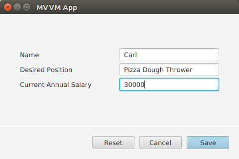
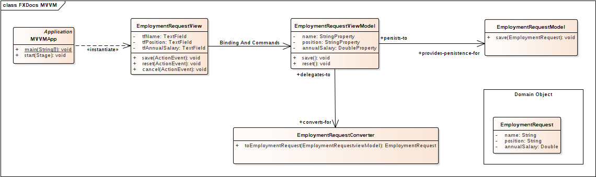
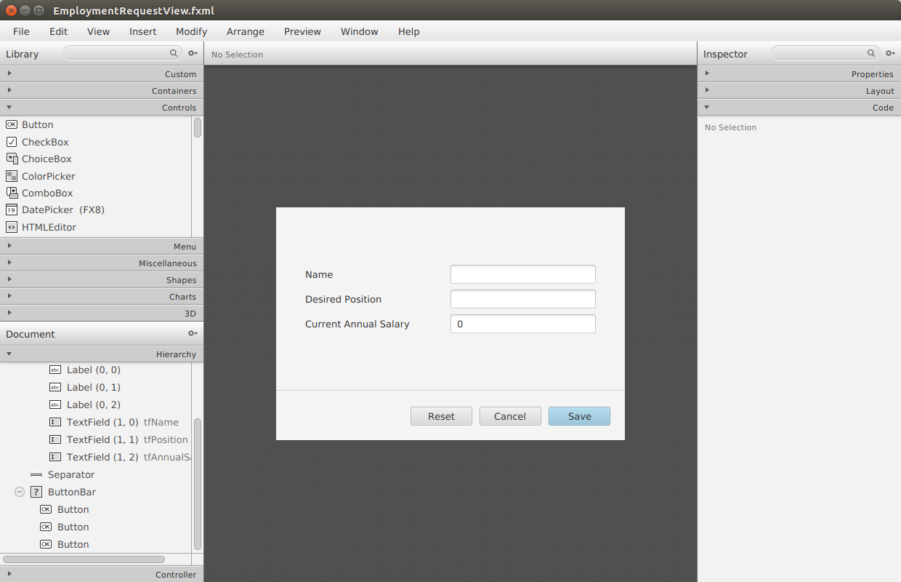

# MVVM模式

模型-视图-视图模型( MVVM )是一种软件架构，它将 UI 控件(视图)与数据访问和业务逻辑(模型)分离开来。这种分离有助于维护阶段的大型应用程序。有了 MVVM，视图的改变——尤其是那些纯粹的修饰——可以不用担心引入副作用。由于MVVM 促进了重用，对模型的更改(通常比视图的变化更小)可以更容易地应用于整个应用程序。

视图和模型之间是 ViewModel。ViewModel 介于视图和模型之间，但不包含对视图的引用。这使得 ViewModel 共享成为可能，这在两个视图显示相似数据时非常有用。

本文给出了一个简化的 MVVM 示例。就业请求表单向后端服务提交几个数据元素。这个屏幕截图显示了设置了姓名、职位和年薪数据元素的应用程序。



输入数据并按 Save 后，Model 对象使用 println() 响应。

程序输出:

```java
saving EmploymentRequest{name='Carl', position='Pizza Dough Thrower', annualSalary=30000.0}
```

如果在填写 TextFields 后按下 Reset 按钮，则表单将恢复到其原始值: 空的姓名和职位以及年薪为 0。

Cancel 按钮结束应用程序。

## 结构

一个简化的 MVVM 应用程序由以下类型的类组成

**应用程序**
主入口

**视图**
UI控件

**模型**
功能调用业务逻辑和数据访问

**视图模型**
包含屏幕状态和 UI 逻辑

**域对象**
与 ui 无关的传输对象

**转换器**
用于 ViewModel 到 Model 通信的 Helper 类

这个 UML 显示了雇佣请求表单的结构。View 类是 EmploymentRequestView，它包含像 Name TextField 这样的 UI 控件对象。ViewModel 类是 EmploymentRequestViewModel，包含 JavaFX 属性。Model 类是 EmploymentRequestModel，它有一个持久化表单的方法。EmploymentRequestConverter 是一个 helper 类。EmploymentRequest 是一个包含数据字段的 POJO。MVVMApp 是主要入口点，是 JavaFX Application 的子类。



## 视图

在 MVVM中，View 类负责 UI 控件，而不是其他。附加到 UI 控件的事件处理程序立即委托给 ViewModel。JavaFX 数据绑定用模型更改更新 UI。在 Employment Request Form中，有三个 textfield 收集来自用户的输入: tfName、tfPosition、tfAnnualSalary。三个按钮启动应用程序上的操作: btnSave, btnCancel, btnReset。这是 EmploymentRequestView 类的开始。

*EmploymentRequestView.class*

```java
public class EmploymentRequestView extends VBox {

    private GridPane gp = new GridPane();

    private TextField tfName = new TextField();
    private TextField tfPosition = new TextField();
    private TextField tfAnnualSalary = new TextField();

    private Button btnSave = new Button("Save");
    private Button btnCancel = new Button("Cancel");
    private Button btnReset = new Button("Reset");

    public EmploymentRequestView() {
        createView();
        bindViewModel();
    }
```

视图知道 ViewModel，并使用 JavaFX 绑定来同步 UI 与 ViewModel。这个演示将 ViewModel 视为一个原型对象，在创建View 对象时创建。另外，ViewModel 可以是单例的，也可以由 CDI 提供。每个 UI 字段都是双向绑定到 ViewModel 的。当 UI 发生变化时——比如通过在 tfName 中输入一个值——ViewModel 中相应的字段就会更新。tfAnnualSalary 字段需要更复杂的表达式，以便将基于字符串的 TextField 转换为 DoubleProperty。

*EmploymentRequestView.class*

```java
    private final EmploymentRequestViewModel viewModel =
            new EmploymentRequestViewModel();

    private void bindViewModel() {

        tfName.textProperty().bindBidirectional(viewModel.nameProperty());

        tfPosition.textProperty().bindBidirectional(viewModel.positionProperty());

        Bindings.bindBidirectional(
                tfAnnualSalary.textProperty(),
                viewModel.annualSalaryProperty(),
                new NumberStringConverter()
        );
    }
```

这个演示中的 UI 是内置在代码中的。下面的 createView() 方法处理表单的布局，并将核心控件(如 tfName 和 btnSave )放在容器中。

*EmploymentRequestView.class*

```java
    private void createView() {
        VBox gpwrap = new VBox();
        gpwrap.setAlignment( Pos.CENTER );

        gp.setPadding( new Insets(40) );
        gp.setVgap( 4 );
        gp.add(new Label("Name"), 0, 0);                  gp.add(tfName, 1, 0);
        gp.add(new Label("Desired Position"), 0, 1);      gp.add(tfPosition, 1, 1);
        gp.add(new Label("Current Annual Salary"), 0, 2); gp.add(tfAnnualSalary, 1, 2);

        final ColumnConstraints col = new ColumnConstraints();
        col.setPercentWidth( 50 );

        gp.getColumnConstraints().addAll( col, col );

        gpwrap.getChildren().add( gp );

        VBox.setVgrow( gpwrap, Priority.ALWAYS );

        btnSave.setOnAction( this::save );
        btnCancel.setOnAction( this::cancel );
        btnReset.setOnAction( this::reset );

        btnSave.setDefaultButton(true);

        ButtonBar buttonBar = new ButtonBar();
        buttonBar.setPadding( new Insets(20.0d) );
        ButtonBar.setButtonData(btnSave, ButtonBar.ButtonData.OK_DONE);
        ButtonBar.setButtonData(btnCancel, ButtonBar.ButtonData.CANCEL_CLOSE);
        ButtonBar.setButtonData(btnReset, ButtonBar.ButtonData.OTHER);

        buttonBar.getButtons().addAll( btnSave, btnCancel, btnReset );

        this.getChildren().addAll(
                gpwrap,
                new Separator(),
                buttonBar);
    }
```

类以按钮的处理程序结束。这些处理程序将它们的操作委托给 ViewModel。

*EmploymentRequestView.class*

```java
    private void save(ActionEvent evt) { viewModel.save(); }

    private void cancel(ActionEvent evt) {
        Platform.exit();
    }

    private void reset(ActionEvent evt) { viewModel.reset(); }
}
```

### FXML and Scene Builder

在本例中，UI 是内置在代码中的。Scene Builder 是一种面向设计的替代方案，可以提高生产效率。要将这个示例转换为FXML (Scene Builder 的产品)，您需要在工具中构建 UI，并用 @FXML 注释 EmploymentRequestView 类的字段和方法。查看下面的截图演示如何在场景生成器。这只是信息，而不是工作演示的一部分。



注意，将视图实现从代码切换到场景构建器不会改变 UML 图的右边“一半”。一个好的设计的标志是当不同的表现形式可以很容易地支持。

## 视图模型

ViewModel 是一个与视图和模型交互的层。在这个简单的表示中，这样一层的价值是有限的;我们可以在Button处理程序中将 TextFields 解压缩到 Model中。随着 UI 变得越来越复杂，使用一个更简单、更面向业务的对象是很有用的。虽然View、Model 和 ViewModel 之间存在一对一的对应关系，但情况并非总是如此。

处理多对多关系是 ViewModel 的关键。可能有许多视图使用相同的Model元素。多个模型可以组成一个视图。

这个 ViewModel 看起来很像稍后将呈现的域对象，但有一个关键的区别: JavaFX 绑定。EmploymentRequestViewModel被绑定到 EmploymentRequestView UI 控件，并且 EmploymentRequestViewModel 的方法将能够访问save()方法中的所有信息。不需要对参数进行额外的封送。

*EmploymentRequestViewModel.class*

```java
public class EmploymentRequestViewModel {

    private final StringProperty name = new SimpleStringProperty("");
    private final StringProperty position = new SimpleStringProperty("");
    private final DoubleProperty annualSalary = new SimpleDoubleProperty();

    private final EmploymentRequestConverter converter =
            new EmploymentRequestConverter();

    private final EmploymentRequestModel model = new EmploymentRequestModel();

    public String getName() {
        return name.get();
    }

    public StringProperty nameProperty() {
        return name;
    }

    public void setName(String name) {
        this.name.set(name);
    }

    public String getPosition() {
        return position.get();
    }

    public StringProperty positionProperty() {
        return position;
    }

    public void setPosition(String position) {
        this.position.set(position);
    }

    public double getAnnualSalary() {
        return annualSalary.get();
    }

    public DoubleProperty annualSalaryProperty() {
        return annualSalary;
    }

    public void setAnnualSalary(double annualSalary) {
        this.annualSalary.set(annualSalary);
    }

    public void save() {
        EmploymentRequest data = converter.toEmploymentRequest( this );
        model.save( data );
    }

    public void reset() {
        this.name.set("");
        this.position.set("");
        this.annualSalary.set(0.0d);
    }
}
```

转换器和模型都被作为原型添加到这个 ViewModel 中，这意味着它们是在创建 ViewModel 时创建的。

### 转换器
转换器是一个在 ViewModel 和域对象之间进行转换的类。在这个应用中，有一个 toEmploymentRequest() 方法，它从ViewModel 字段中创建一个对象。

## 模型

最后，模型持久化信息。这个 Model 示例有一个模拟方法，它将验证它是否接收到 save() 操作的正确数据。

*EmploymentRequestModel.class*

```java
public class EmploymentRequestModel {

    public void save(EmploymentRequest req) {
        System.out.println("saving " + req);
    }
}
```

这是用于将数据从模型传输到 UI 的普通 Java 对象。

*EmploymentRequest.class*

```java
public class EmploymentRequest {

    private final String name;
    private final String position;
    private final Double annualSalary;

    public EmploymentRequest(String name,
                             String position,
                             Double annualSalary) {
        this.name = name;
        this.position = position;
        this.annualSalary = annualSalary;
    }

    public String getName() {
        return name;
    }

    public String getPosition() {
        return position;
    }

    public Double getAnnualSalary() {
        return annualSalary;
    }

    @Override
    public String toString() {
        return "EmploymentRequest{" +
                "name='" + name + '\'' +
                ", position='" + position + '\'' +
                ", annualSalary=" + annualSalary +
                '}';
    }
}
```

JavaFX 为开发人员提供了强大的工具包来构建应用程序。然而，一个有效的程序仍然需要一个设计。MVVM 是一种架构模式，它将称为视图的纯 UI 类与称为模型的纯数据类分离开来。中间是 ViewModel，它严重依赖于 JavaFX 中的数据绑定。

## 进一步的研究

有时，视图需要知道模型的更改。因为 MVVM 规定了单向控制流——View 到 ViewModel 到 Model，而不是相反——所以需要一种不同于数据绑定的机制来让 ViewModel 意识到 Model 的更改。发布/订阅库可以用于此需求，它将代理Model/ViewModel 交互。ViewModel将收到来自Model的通知，而 Model 将不需要对 ViewModel 对象的引用。

要了解更多关于 MVVM 和 JavaFX 的信息，请查看 mvvmFX 项目。该项目中的示例为本演示提供了基础。

[mvvmFX](https://github.com/sialcasa/mvvmFX)

## 完整代码

这个例子中完整的代码可以在这里作为 Gradle 项目获得。JAR 中有两个示例。运行net.bekwam.bkcourse.mvvmapp.MVVMApp类。

[bkcourse_mvvmapp_sources.zip](https://courses.bekwam.net/public_tutorials/source/bkcourse_mvvmapp_sources.zip)