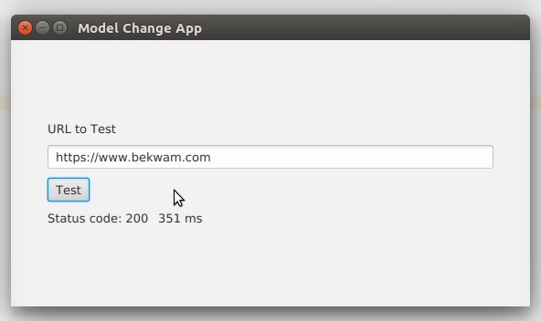
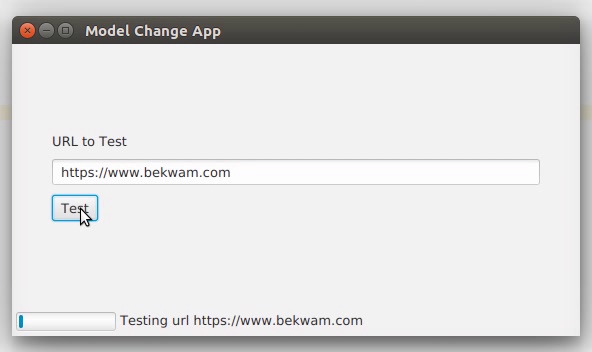
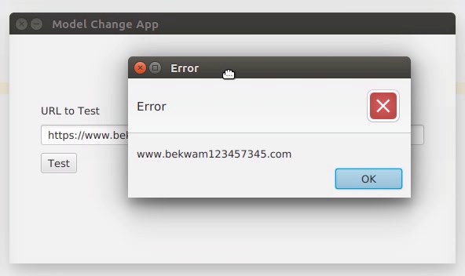
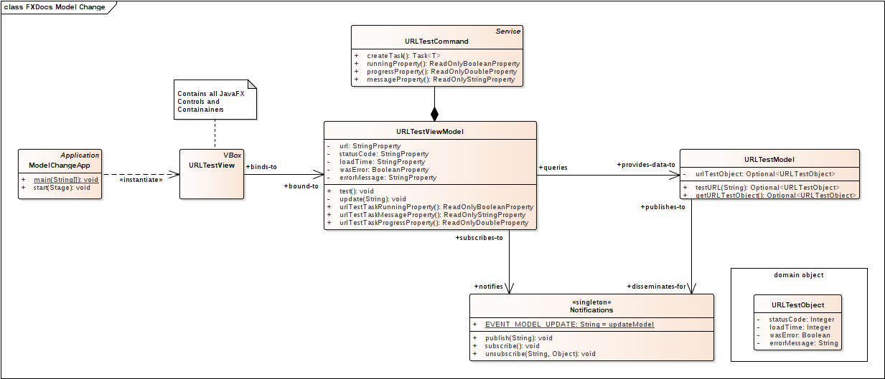
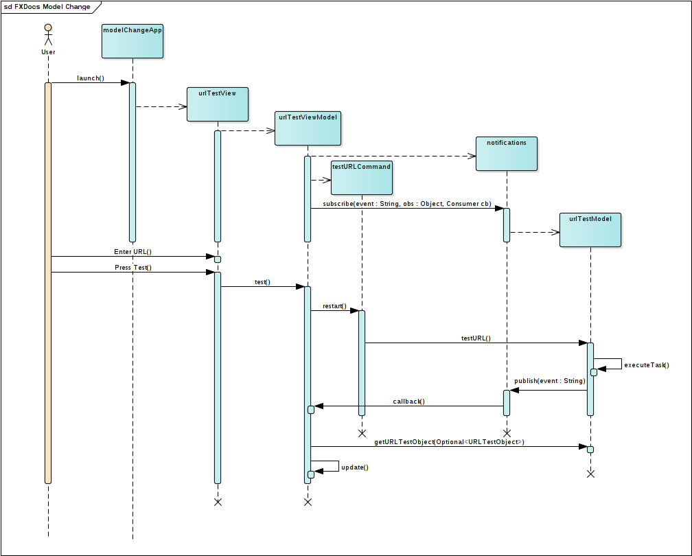

# 基于MVVM改进的模型

上一篇文章展示了如何将基于 JavaFX 绑定的 ViewModel 添加到应用程序体系结构中。然而，所呈现的模型是一个简单的服务调用。这扩展了先前的概念并添加了

- 异步,

- 进度条和状态标签，以及

- 事件广播。

所有耗时超过几毫秒的操作都应该在单独的线程上运行。当代码转移到新的计算机和新的网络配置时，一些运行速度很快但涉及到 IO 或网络的东西往往会变成性能问题。使用 JavaFX Task 来调用 Model 操作。当这个可能很长的过程运行时，通过 ProgressBar 和 Label 向用户提供反馈。状态标签将消息从 JavaFX 任务传递给用户。

重要的是，模型不包含对 ViewModel 的引用，因此引入了事件通知方案。ViewModel 监听来自 Model 的EVENT_MODEL_UPDATE 消息。尽管这个例子只使用了一个 ViewModel，但是这种模式使得多个 ViewModel 能够感知来自单个 Model 组件的数据更改。

## 示例程序

本节中的演示程序是一个 URL 测试器。用户在 TextField 中输入 URL 并按下 Submit 按钮。如果对指定 URL 的 HTTP 请求成功返回，则会显示 HTTP 响应状态码以及请求所花费的毫秒数。这个屏幕截图显示了一个成功的使用。



UI 在整个请求过程中保持响应。响应性来自于使用 JavaFX Task 在后台线程上运行 URL 检索。为了让用户知道正在进行处理，UI 控件通过 JavaFX 绑定绑定到 Task 的属性。这个屏幕截图显示了用户在 Task 运行时收到的反馈。



当 Submit 按钮被按下时，将显示一对控件: 一个 ProgressBar 和一个 Label。这两个控件都更新了有关正在运行的后台线程的信息。

URL 检索中的错误通过从模型中传递一个备用响应对象来处理。在成功的情况下，Model 返回 HTTP 状态代码和经过的时间。在错误情况下，Model 设置一个标志并返回一条错误消息。这个屏幕截图显示了视图响应模型中的错误而产生的错误对话框。errorMessage 来自被抛出异常的 message 属性。如果需要，可以添加额外的字段，如 Exception 类名。



## 设计

演示程序由单个 View / ViewModel / Model 三元组组成。视图通过 JavaFX 绑定与 ViewModel 通信。View 中的 UI 控件被绑定到 ViewModel中的 JavaFX 属性。View 中的事件处理程序委托给 ViewModel 中的方法。ViewModel 形成一个与模型交互的异步命令。模型通过通知子系统而不是对象引用间接地与 ViewModel 通信。

这是程序的UML类模型。



URLTestView 是 View 组件，包含 UI 控件。ViewModel 包含域的属性——url、最后状态码、最后经过的时间——以及屏幕状态，比如 urlTestTaskRunning。模型包含一个服务调用，并使用一个与 ui 无关的 POJO URLTestObject。模型和ViewModel 之间的通信通过 notificationsingleton 进行代理，该 singleton 具有发布(用于模型)和订阅(用于 ViewModel )的方法。

这个序列图显示了应用程序如何将自己连接起来，以及测试操作之后的交互。



在创建了所有对象之后，用户启动一个测试操作。这将导致创建一个 TestURLCommand 对象，它是一个 JavaFX 服务。服务调用一个 Model方法 testURL()。当 testURL() 完成时，它发布一个通知。此通知触发对 ViewModel 的调用以刷新自身，这将使用对 Model 的第二次调用。ViewModel 刷新设置了自动更新视图的 ViewModel JavaFX 属性。

## 视图

视图是一个 StackPane，包含将收集 URL 输入的 TextField 和提交按钮。我们使用了 StackPane，以便在不破坏主UI控件居中的情况下添加临时状态显示。包含状态标签和进度条的 HBox 总是出现在左下角，但除非任务正在运行，否则是隐藏的。

*URLTestView.class*

```java
public class URLTestView extends StackPane {

    private final URLTestViewModel testViewModel =
            new URLTestViewModel();

    public URLTestView() {

        Label lblURL = new Label("URL to Test");
        TextField tfURL = new TextField();
        Button btnTest = new Button("Test");
        Label lblStatus = new Label("");
        Label lblLoadTime = new Label("");
        HBox resultHBox = new HBox(lblStatus, lblLoadTime);
        resultHBox.setSpacing(10);

        VBox vbox = new VBox( lblURL, tfURL, btnTest, resultHBox );
        vbox.setPadding( new Insets(40) );
        vbox.setSpacing( 10 );
        vbox.setAlignment(Pos.CENTER_LEFT);

        Label lblTaskStatus = new Label("");
        ProgressBar pb = new ProgressBar();
        HBox statusHBox = new HBox(pb, lblTaskStatus);
        statusHBox.setSpacing(4);
        statusHBox.setPadding(new Insets(4));
        statusHBox.setMaxHeight( 20 );

        StackPane.setAlignment(statusHBox, Pos.BOTTOM_LEFT );

        this.getChildren().addAll( vbox, statusHBox );
```

URLTestViewModel 对象是在这个类中创建的。或者，依赖注入可以用于在其他视图中分发相同的 ViewModel 对象。

URLTestView 构造函数继续使用几个绑定表达式。它们将 UI 控件链接到ViewModel属性。

*URLTestView.class*

```java
        lblStatus.textProperty().bind( testViewModel.statusCodeProperty() );
        lblLoadTime.textProperty().bind( testViewModel.loadTimeProperty() );
        testViewModel.urlProperty().bind( tfURL.textProperty() );

        statusHBox.visibleProperty().bind(testViewModel.urlTestTaskRunningProperty() );
        pb.progressProperty().bind( testViewModel.urlTestTaskProgressProperty() );
        lblTaskStatus.textProperty().bind( testViewModel.urlTestTaskMessageProperty());
```

上述语句为 ViewModel 中相应属性的更改注册了 UI 控件，但 turl 除外。tl 使用不同的绑定方向，因为它正在为ViewModel生成值。在某些情况下，如果控件既可以由用户操作又可以从 ViewModel 设置，则绑定可能需要是双向的。

启动 testURL() 操作的操作被映射到 Submit Button。

*URLTestView.class* 

```java
      btnTest.setOnAction( (evt) -> testViewModel.test() );
```

URLTestView 构造函数以一个特殊的 ChangeListener 绑定到 ViewModel 属性结束。这是发生错误的通知。当 ViewModel的 errorMessage 属性被通知时，视图将显示一个弹出对话框。

*URLTestView.class* 

```java
        testViewModel.errorMessageProperty().addListener(
                (obs,ov,nv) -> {
                    if( nv != null && !nv.isEmpty() ) {
                        Alert alert = new Alert(
                                Alert.AlertType.ERROR, nv
                        );
                        alert.showAndWait();
                    }
                }
        );
```

## 视图模型

URLTestView 将它的UI控件绑定到 URLTestViewModel 中的属性。URLTestViewModel 类的这一部分显示了 View 使用的属性及其相应的访问方法。还列出了 test() 方法(映射到 Submit Button 按下事件)。对象 urlTestCommand 将在后面介绍。

*URLTestViewModel.class*

```java
public class URLTestViewModel {

    // Data elements
    private final StringProperty url = new SimpleStringProperty("");
    private final StringProperty statusCode = new SimpleStringProperty("");
    private final StringProperty loadTime = new SimpleStringProperty("");

    // Status elements
    private final BooleanProperty wasError = new SimpleBooleanProperty(false);
    private final StringProperty errorMessage = new SimpleStringProperty("");

    public StringProperty urlProperty() { return url; }

    public StringProperty statusCodeProperty() { return statusCode; }

    public StringProperty loadTimeProperty() { return loadTime; }

    public StringProperty errorMessageProperty() { return errorMessage; }

    public ReadOnlyBooleanProperty urlTestTaskRunningProperty() {
        return urlTestCommand.runningProperty();  // presented later
    }

    public ReadOnlyStringProperty urlTestTaskMessageProperty() {
        return urlTestCommand.messageProperty();  // presented later
    }

    public ReadOnlyDoubleProperty urlTestTaskProgressProperty() {
        return urlTestCommand.progressProperty();  // presented later
    }

    public void test() {
       urlTestCommand.restart();  // presented later
    }
```

URLTestViewModel 与两个对象协作: URLTestModel 和 Notifications。URLTestViewModel 在其构造函数中订阅Notification。当 Notifications 对象发布 EVENT_MODEL_UPDATE时，URLTestViewModel 方法“update”将被调用。

*URLTestViewModel.class* 

```java
    private final URLTestModel urlTestModel = new URLTestModel();

    private final Notifications notifications = new Notifications();

    public URLTestViewModel() {
        notifications.subscribe(Notifications.EVENT_MODEL_UPDATE,
                                this,
                                this::update);  // presented later
    }
```

### Command

urlTestCommand 是一个 JavaFX 服务对象。作为 URLTestViewModel 类的一部分，urlTestCommand 可以访问 url 属性，该属性为调用 Model 对象提供了一个参数。urlTestCommand 也使用 URLTestModel 成员来发起调用来测试URL。

*URLTestViewModel.class*

```java
    private final Service<Void> urlTestCommand = new Service<Void>() {
        @Override
        protected Task<Void> createTask() {
            return new Task<Void>() {
                @Override
                protected Void call() throws Exception {
                    updateProgress(0.1d, 1.0d);
                    updateMessage("Testing url " + url.get());
                    urlTestModel.testURL( url.get() );
                    return null;
                }
                protected void failed() {
                    getException().printStackTrace();  // just in case
                }
            };
        }
    };
```

之所以使用 JavaFX 服务，是因为服务对象需要始终存在以实现绑定目的。URLTestView将它的进度条、状态标签和容器控件绑定到 URLTestViewModel 对象，该对象将在应用的整个生命周期中可用。Task 是一次性调用，对于多次 test() 调用，使用它是行不通的。

### 异步

本文中的设计将异步处理的负担放在了 ViewModel 上。这为使用 JavaFX 绑定的视图控件提供了直接反馈。另一种方法是使用通用事件发出模式来侦听任务启动、任务结束、进度和消息事件。这将支持将 urlTestCommand Service 子类拆分为一个单独的代码模块。

URLTestViewModel 类的表示以 update() 方法结束。该方法对 Model 发出调用，解包结果，并更新 ViewModel 属性。回想一下，视图已经绑定到这些属性，并将自动更新(视图中没有类似的 update() 方法)。

*URLTestViewModel.class*

```java
    private void update(String event) {

        urlTestModel.getUrlTestObject().ifPresent(

            (testObject) -> {

                wasError.set( testObject.getWasError() );

                if( !testObject.getWasError() ) {

                    statusCode.set(
                            "Status code: " +
                            String.valueOf(testObject.getStatusCode())
                    );

                    loadTime.set(
                            String.valueOf(testObject.getLoadTime()) +
                                    " ms"
                    );

                    errorMessage.set(testObject.getErrorMessage());
                } else {
                    statusCode.set("");  // use empty TextField, not 0
                    loadTime.set("");  // use empty TextField, not 0
                    errorMessage.set( testObject.getErrorMessage() );
                }
            });
    }
```

## 模型

URLTestModel 完整地呈现在下面。URLTestModel 维护一个域对象的副本。初始化时，该对象为空，因此使用 Optional。为 ViewModels 提供了一个 getter。testURL() 方法发出一个 HTTP GET 调用，并在 URLTestObject 成员中记录结果。如果HTTP GET 调用成功，URLTestObject 将包含状态码(可能是200)和经过的时间。如果不成功，URLTestObject 将设置一个方便的 wasError 标志和一个 errorMessage。

当模型在URL中检索到内容或生成错误时，将调用 Notifications 对象的 publish() 方法。这将提示 URLTestViewModel 以解耦的方式更新自身。重要的是要注意，URLTestModel 不包含对 URLTestViewModel 对象的引用。

*URLTestModel.class*

```java
public class URLTestModel {

    private final Notifications notifications =
            new Notifications();

    private Optional<URLTestObject> urlTestObject =
            Optional.empty();

    public Optional<URLTestObject> getUrlTestObject() {
        return urlTestObject;
    }

    public Optional<URLTestObject> testURL(String url) {

        try {
            long startTimeMillis = System.currentTimeMillis();
            HttpURLConnection urlConnection =
                    (HttpURLConnection) new URL(url).openConnection();
            try (
                    InputStream is = urlConnection.getInputStream();
            ) {
                while (is.read() != -1) {
                }
            }
            long endTimeMillis = System.currentTimeMillis();

            URLTestObject uto = new URLTestObject(
                    urlConnection.getResponseCode(),
                    (int) (endTimeMillis - startTimeMillis)
            );

            urlTestObject = Optional.of(uto);

        } catch(Exception exc) {
            URLTestObject uto = new URLTestObject(exc.getMessage());
            urlTestObject = Optional.of(uto);
        }

        notifications.publish(Notifications.EVENT_MODEL_UPDATE);

        return urlTestObject;
    }
}
```

URLTestModel 也不尝试使用 JavaFX 绑定到 URLTestViewModel。由于异步是在 ViewModel 层处理的，所以模型可以自由地在JavaFX线程之外操作。如果使用了绑定，尝试双重绑定 (View→ViewModel→Model) 将导致应用程序线程错误。封装在 Platform.runLater() 中，双重绑定不会违反规定的依赖顺序—— ViewModel 已经保存了对 Model 的引用——但可能导致不一致的更新。

这个 POJO 是模型使用的域对象。作为 POJO，它可以在公共库中维护，并在非 ui 组件(如 RESTful web 服务项目)之间共享。

*URLTestObject.class*

```java
public class URLTestObject {

    private final Integer statusCode;
    private final Integer loadTime;
    private final Boolean wasError;
    private final String errorMessage;

    public URLTestObject(Integer statusCode,
                         Integer loadTime) {
        this.statusCode = statusCode;
        this.loadTime = loadTime;
        wasError = false;
        errorMessage = "";
    }

    public URLTestObject(String errorMessage) {
        this.statusCode = null;
        this.loadTime = null;
        wasError = true;
        this.errorMessage = errorMessage;
    }

    public Integer getLoadTime() {
        return loadTime;
    }

    public Integer getStatusCode() {
        return statusCode;
    }

    public Boolean getWasError() {
        return wasError;
    }

    public String getErrorMessage() {
        return errorMessage;
    }
}
```

## 通知

这个类是一个轻量级的发布/订阅实现。事件类型被注册为文件顶部的字符串常量。订阅者由其类 hashCode 标识。所有发布的事件都将在 JavaFX 线程上运行。

*Notifications.class*

```java
public class Notifications {

    public final static String EVENT_MODEL_UPDATE = "modelUpdate";

    private final Map<String, List<SubscriberObject>> subscribers = new LinkedHashMap<>();

    private static Notifications instance = new Notifications();

    public void publish(String event) {

        Platform.runLater( () -> {
            List<SubscriberObject> subscriberList = instance.subscribers.get(event);

            if (subscriberList != null) {

                subscriberList.forEach(
                    subscriberObject -> subscriberObject.getCb().accept(event)
                    );

                // event ends after last subscriber gets callback
            }
        } );
    }

    public void subscribe(String event, Object subscriber, Consumer<String> cb) {

        if( !instance.subscribers.containsKey(event) ) {
            List<SubscriberObject> slist = new ArrayList<>();
            instance.subscribers.put( event, slist );
        }

        List<SubscriberObject> subscriberList = instance.subscribers.get( event );

        subscriberList.add( new SubscriberObject(subscriber, cb) );
    }

    public void unsubscribe(String event, Object subscriber) {

        List<SubscriberObject> subscriberList = instance.subscribers.get( event );

        if (subscriberList == null) {
            subscriberList.remove( subscriber );
        }
    }

    static class SubscriberObject {

        private final Object subscriber;
        private final Consumer<String> cb;

        public SubscriberObject(Object subscriber,
                                Consumer<String> cb) {
            this.subscriber = subscriber;
            this.cb = cb;
        }

        public Object getSubscriber() {
            return subscriber;
        }

        public Consumer<String> getCb() {
            return cb;
        }

        @Override
        public int hashCode() {
            return subscriber.hashCode();
        }

        @Override
        public boolean equals(Object obj) {
            return subscriber.equals(obj);
        }
    }
}
```

Notifications 是一个单例，因此任何类——在本例中包括 URLTestViewModel 和 URLTestModel ——都将订阅并发布到正确的实例。

##  App

为了完整起见，下面列出了 Application 子类。

*ModelChangeApp.class*

```java
public class ModelChangeApp extends Application {

    @Override
    public void start(Stage primaryStage) throws Exception {

        Scene scene = new Scene(new URLTestView());

        primaryStage.setTitle("Model Change App");
        primaryStage.setScene( scene );
        primaryStage.setWidth(568);
        primaryStage.setHeight(320);
        primaryStage.show();
    }

    public static void main(String[] args) {
        launch(args);
    }
}
```

MVVM 是一个将视图与模型分离的体系结构。与其他体系结构不同，这种分离包括一个特定的依赖关系图:视图依赖于ViewModel 依赖于模型。所有三种组件类型都是协作的，但是如果数据在依赖关系图的相反方向移动，则通信是间接的。在这个例子中，间接通信是由 JavaFX 绑定和一个特殊的 Notifications 类提供的。通过保持模型和视图模型不依赖于视图，MVVM 架构促进了重用。URLTestModel 可以被其他视图模型使用，URLTestViewModel 也可以被其他视图使用。

## 完整代码

这个例子中完整的代码可以在这里作为 Gradle 项目获得。JAR 中有两个示例。运行net.bekwam.bkcourse.modelchangeapp.ModelChangeApp类。

[bkcourse_mvvmapp_sources.zip](https://courses.bekwam.net/public_tutorials/source/bkcourse_mvvmapp_sources.zip)

