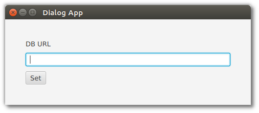
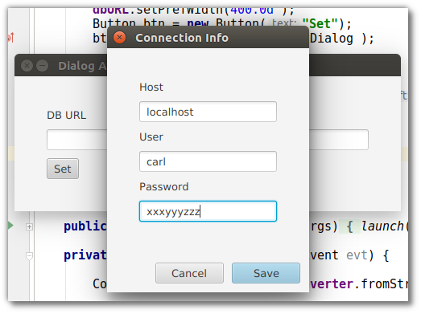
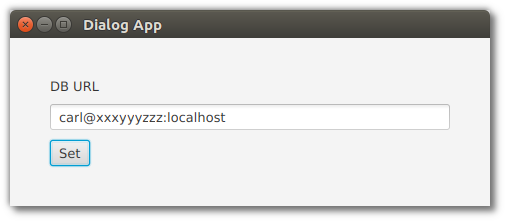

## 对话类

Dialog 类是 JavaFX 库中令人惊讶的后来者。Dialog 类显示自定义的支持窗口，以执行操作或检索其他信息。子类 Alert 也是可用的，它更适合于集中的交互，比如确认、检索文本值 (TextInputDialog) 或选定项 (ChoiceDialog)。

本节将演示建立在域对象 ConnectionInfo 上的 Dialog 类。显示一个主屏幕，其中显示一个数据库 URL 的 TextField。按下设置按钮显示对话框。如果用户填写值并按下 Save 按钮，对话框将被解除，ConnectionInfo 域对象将返回给调用者。如果按下 Cancel 按钮，则返回一个空的 Optional。

这张截图显示了应用程序启动时的情况。DB URL字段为空。



按设置按钮显示对话框。用户已填写主机、用户名和密码的值。



通过Save按钮关闭对话框形成一个 ConnectionInfo 对象，该对象返回给调用者。该值形成一个字符串，并放入TextField。



本例中还支持反向交互。如果用户输入格式良好的 URL，则该 URL 将被解析并显示在对话框中。URL 字符串验证已被取消。无效的 URL 字符串将导致一个空的对话框。

## App

JavaFX Application 子类为 DB URL TextField 和 Save Button 添加了 UI 控件。

*DialogApp.java*

```java
public class DialogApp extends Application {

    private final TextField dbURL = new TextField();

    @Override
    public void start(Stage primaryStage) throws Exception {

        Label label = new Label("DB URL");
        dbURL.setPrefWidth(400.0d );
        Button btn = new Button("Set");
        btn.setOnAction( this::showSetDialog );

        VBox vbox = new VBox(label, dbURL, btn );
        vbox.setSpacing( 10.0d );
        vbox.setPadding( new Insets(40.0d) );

        Scene scene = new Scene( vbox );

        primaryStage.setTitle("Dialog App");
        primaryStage.setScene( scene );
        primaryStage.show();
    }

    public static void main(String[] args) {
        launch(args);
    }
```

showSetDialog() 是一个方法引用，它初始化 ConnectionInfo 对象，显示对话框，并在用户设置时检索值。

*DialogApp.java*

```java
    private void showSetDialog(ActionEvent evt) {

        ConnectionInfo fromURL = ciConverter.fromString( dbURL.getText() );

        ConnectionDialog dialog = new ConnectionDialog(fromURL);

        Optional<ConnectionInfo> ci = dialog.showAndWait();

        ci.ifPresent( c -> dbURL.setText(
                ciConverter.toString(c)
            )
        );
    }
```

该应用程序使用 JavaFX StringConverter 来封装从 ConnectionInfo 对象的字段集形成字符串的代码。StringConverter 作为一个字段存储在 Application 子类中。

*DialogApp.java*

```java
    private final ConnectionInfoStringConverter ciConverter =
            new ConnectionInfoStringConverter();


   class ConnectionInfoStringConverter extends StringConverter<ConnectionInfo> {

        private final String format = "%s@%s:%s";

        @Override
        public String toString(ConnectionInfo c) {
            return String.format( format, c.getUsername(), c.getPassword(), c.getHost() );
        }

        @Override
        public ConnectionInfo fromString(String s) {

            if( s != null && s.contains("@") && s.contains(":") ) {
                String[] toks = s.split("@");
                String username = toks[0];
                String[] secondPart = toks[1].split(":");
                String password = secondPart[0];
                String host = secondPart[1];
                ConnectionInfo ci = new ConnectionInfo(
                        username, password, host
                );
                return ci;
            }

            return null;
        }
    }
```

##  对话框

Dialog 子类将UI控件添加到构造函数中的 DialogPane 字段。注意，这里缺少显式的 ActionEvent 处理程序。当使用Dialog 或 Alert 时，ButtonType 和 ButtonData 优先于原始的 Button 对象。这些高阶对象使应用程序 UI 更加一致，因为按钮的位置、标签和行为是在对话框抽象中传递的。

子类包含 ConnectionInfo 域对象的类型参数。

*ConnectionDialog.java*

```java
public class ConnectionDialog extends Dialog<ConnectionInfo> {

    private final TextField tfHost = new TextField();
    private final TextField tfUser = new TextField();
    private final TextField tfPassword = new TextField();

    public ConnectionDialog(ConnectionInfo initialData) {

        Label hostLabel = new Label("Host");
        Label userLabel = new Label("User");
        Label passwordLabel = new Label("Password");

        VBox vbox = new VBox(
                hostLabel, tfHost,
                userLabel, tfUser,
                passwordLabel, tfPassword
        );

        vbox.setSpacing( 10.0d );
        vbox.setPadding( new Insets(40.0d) );

        DialogPane dp = getDialogPane();

        setTitle( "Connection Info" );
        setResultConverter( this::formResult );

        ButtonType bt = new ButtonType("Save", ButtonBar.ButtonData.OK_DONE);
        dp.getButtonTypes().addAll( bt, ButtonType.CANCEL );
        dp.setContent( vbox );

        init( initialData );
    }
```

init() 方法根据 ConnectionInfo 字段设置 Dialog UI 控件。

*ConnectionDialog.java*

```java
    private void init(ConnectionInfo ci) {
        if (ci != null) {
            tfHost.setText( ci.getHost() );
            tfUser.setText( ci.getUsername() );
            tfPassword.setText( ci.getPassword() );
        }
    }
```

setResultConverter() 是 Dialog 将其域对象通信回调用者的机制。转换器是一个回调函数，如果可以从输入生成ConnectionInfo 对象，则返回该对象。在这种情况下，如果按下 Save 按钮，Dialog 将决定发送回一个对象。验证对话框字段可以作为 TextField 本身的一部分执行，也可以作为附加到保存按钮的 EventFilter 执行。

*ConnectionDialog.java*

```java
    private ConnectionInfo formResult(ButtonType bt) {
        ConnectionInfo retval = null;
        if( bt.getButtonData() == ButtonBar.ButtonData.OK_DONE ) {
            retval = new ConnectionInfo(
                    tfHost.getText(), tfUser.getText(), tfPassword.getText()
            );
        }
        return retval;
    }
```

## 域对象

域对象 ConnectionInfo 是一个不可变的 POJO。

*ConnectionInfo.java*

```java
public class ConnectionInfo {

    private final String host;
    private final String username;
    private final String password;

    public ConnectionInfo(String host,
                          String username,
                          String password) {
        this.host = host;
        this.username = username;
        this.password = password;
    }

    public String getHost() {
        return host;
    }

    public String getUsername() {
        return username;
    }

    public String getPassword() {
        return password;
    }
}
```

JavaFX Dialog 和 Alert 子类是提供比原始 Stage 更简单的界面和更一致风格的窗口。当需要从用户检索警告、确认或单个值时，Alert 是首选类。对话框用于与用户进行复杂但包含的交互。这个例子展示了主 Stage 如何通过将详细信息的检索委托给 Dialog 来保持其视图的简单性。Dialog -当与类型参数配对时-通过将 showAndWait() 调用转换为返回值的函数来改善应用程序中的信息隐藏。

## 完整代码

完整的源代码和 Gradle 项目可以在下面的链接中找到。

[DialogApp Source Zip](https://courses.bekwam.net/public_tutorials/source/bkcourse_dialogapp_sources.zip)