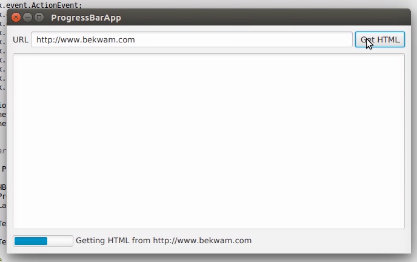
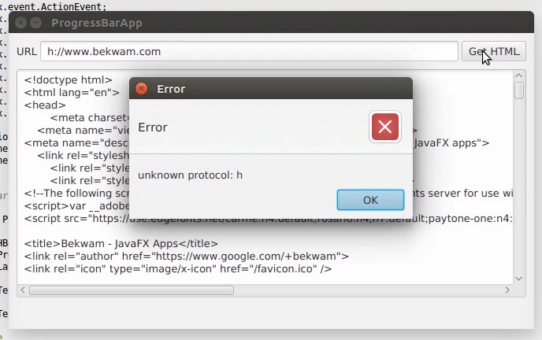

# Tasks

本文演示了如何使用 JavaFX Task 来保持 UI 响应性。任何超过几百毫秒的操作都必须在单独的线程上执行，以避免锁定UI。Task 将长时间运行的操作中的步骤序列打包，并为可能的结果提供回调。

Task类还通过属性让用户知道操作，这些属性可以绑定到像ProgressBars和Labels这样的UI控件。绑定动态地更新UI。这些属性包括

- runningProperty—任务是否正在运行

- progressProperty—操作完成的百分比

- messageProperty -描述操作步骤的文本

## 示范

下面的屏幕截图显示了 HTML 检索应用程序的操作。

输入 URL 并按 “Go” 将启动 JavaFX Task。运行时，任务将显示一个包含进度条和标签的 HBox。ProgressBar 和 Label 在整个操作过程中不断更新。



检索完成后，将调用succeeded()回调并更新UI。注意，succeeded()回调发生在FX线程上，所以操作控件是安全的。


如果检索 HTML 出现错误，则调用 failed() 回调并显示错误警报。failed() 也发生在 FX 线程上。这个截图显示了无效的输入。URL 中使用了 “h”，而不是正确的 “http”。



## 代码

事件处理程序放置在创建任务的 Get HTML 按钮上。Task 的入口点是 call() 方法，该方法首先调用 updateMessage() 和updateProgress()。这些方法在 FX 线程上执行，并将导致对任何绑定属性的更新。

程序通过使用标准 java.net 类发出 HTTP GET 来继续。从检索到的字符中构建一个字符串 “retrieve”。通过对updateMessage() 和 updateProgress() 的更多调用来更新消息和进度属性。call() 方法以返回包含 HTML 文本的 String 结束。

如果操作成功，则调用 succeeded()回调。getValue() 是一个Task方法，它将返回Task中累积的值(召回“retrieve”)。值的类型是在泛型参数中提供的，在本例中为 “String”。这可以是一个复杂的类型，如域对象或集合。succeeded() 操作运行在FX线程上，因此 getValue() 字符串直接设置在 TextArea 上。

如果操作失败，则抛出异常。异常被任务捕获并转换为失败()调用。failed() 也是 FX 线程安全的，它会显示一个警告。

```java
String url = tfURL.getText();

Task<String> task = new Task<String>() {

    @Override
    protected String call() throws Exception {

        updateMessage("Getting HTML from " + url );
        updateProgress( 0.5d, 1.0d );

        HttpURLConnection c = null;
        InputStream is = null;
        String retval = "";

        try {

            c = (HttpURLConnection) new URL(url).openConnection();

            updateProgress( 0.6d, 1.0d );
            is = c.getInputStream();
            int ch;
            while( (ch=is.read()) != -1 ) {
                retval += (char)ch;
            }

        } finally {
            if( is != null ) {
                is.close();
            }
            if( c != null ) {
                c.disconnect();
            }
        }

        updateMessage("HTML retrieved");
        updateProgress( 1.0d, 1.0d );

        return retval;
    }

    @Override
    protected void succeeded() {
        contents.setText( getValue() );
    }

    @Override
    protected void failed() {
        Alert alert = new Alert(Alert.AlertType.ERROR, getException().getMessage() );
        alert.showAndWait();
    }
};
```

注意，任务不直接更新 ProgressBar 和状态标签。相反，Task会安全地调用 updateMessage() 和 updateProgress()。为了更新 UI，在以下语句中使用了 JavaFX  绑定。

```java
bottomControls.visibleProperty().bind( task.runningProperty() );
pb.progressProperty().bind( task.progressProperty() );
messageLabel.textProperty().bind( task.messageProperty() );
```

Task.runningProperty 是一个布尔值，可以绑定到 bottomControls HBox 的可见属性。Task.progressProperty 是一个双精度对象，可以绑定到 ProgressBar的progressProperty。 Task.messageProperty 是一个字符串，可以绑定到状态标签textProperty。

要运行  Task，创建一个提供 Task 作为构造函数参数的线程，并调用 start()。

```java
new Thread(task).start();
```

对于任何长时间运行的操作-文件 IO，网络-使用 JavaFX 任务来保持应用程序的响应。JavaFX Task 为您的应用程序提供了一种处理异步操作的一致方式，并公开了一些可用于消除模板和编程逻辑的属性。

## 完整代码

代码可以在单个 .java 文件中进行测试。

```java
public class ProgressBarApp extends Application {

    private HBox bottomControls;
    private ProgressBar pb;
    private Label messageLabel;

    private TextField tfURL;

    private TextArea contents;

    @Override
    public void start(Stage primaryStage) throws Exception {

        Parent p = createMainView();

        Scene scene = new Scene(p);

        primaryStage.setTitle("ProgressBarApp");
        primaryStage.setWidth( 667 );
        primaryStage.setHeight( 376 );
        primaryStage.setScene( scene );
        primaryStage.show();
    }

    private Parent createMainView() {

        VBox vbox = new VBox();
        vbox.setPadding( new Insets(10) );
        vbox.setSpacing( 10 );

        HBox topControls = new HBox();
        topControls.setAlignment(Pos.CENTER_LEFT);
        topControls.setSpacing( 4 );

        Label label = new Label("URL");
        tfURL = new TextField();
        HBox.setHgrow( tfURL, Priority.ALWAYS );
        Button btnGetHTML = new Button("Get HTML");
        btnGetHTML.setOnAction( this::getHTML );
        topControls.getChildren().addAll(label, tfURL, btnGetHTML);

        contents = new TextArea();
        VBox.setVgrow( contents, Priority.ALWAYS );

        bottomControls = new HBox();
        bottomControls.setVisible(false);
        bottomControls.setSpacing( 4 );
        HBox.setMargin( bottomControls, new Insets(4));

        pb = new ProgressBar();
        messageLabel = new Label("");
        bottomControls.getChildren().addAll(pb, messageLabel);

        vbox.getChildren().addAll(topControls, contents, bottomControls);

        return vbox;
    }

    public void getHTML(ActionEvent evt) {

        String url = tfURL.getText();

        Task<String> task = new Task<String>() {

            @Override
            protected String call() throws Exception {

                updateMessage("Getting HTML from " + url );
                updateProgress( 0.5d, 1.0d );

                HttpURLConnection c = null;
                InputStream is = null;
                String retval = "";

                try {

                    c = (HttpURLConnection) new URL(url).openConnection();

                    updateProgress( 0.6d, 1.0d );
                    is = c.getInputStream();
                    int ch;
                    while( (ch=is.read()) != -1 ) {
                        retval += (char)ch;
                    }

                } finally {
                    if( is != null ) {
                        is.close();
                    }
                    if( c != null ) {
                        c.disconnect();
                    }
                }

                updateMessage("HTML retrieved");
                updateProgress( 1.0d, 1.0d );

                return retval;
            }

            @Override
            protected void succeeded() {
                contents.setText( getValue() );
            }

            @Override
            protected void failed() {
                Alert alert = new Alert(Alert.AlertType.ERROR, getException().getMessage() );
                alert.showAndWait();
            }
        };

        bottomControls.visibleProperty().bind( task.runningProperty() );
        pb.progressProperty().bind( task.progressProperty() );
        messageLabel.textProperty().bind( task.messageProperty() );

        new Thread(task).start();
    }

    public static void main(String[] args) {
        launch(args);
    }
}
```

