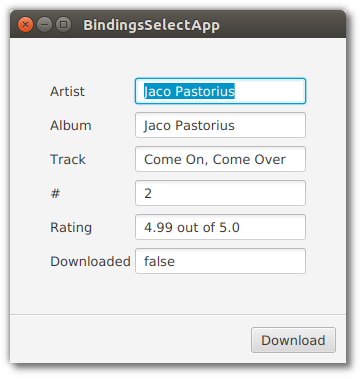
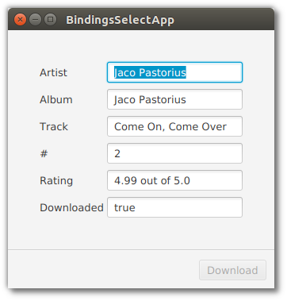

# 对象绑定

在涉及非 javafx 技术的大型应用程序中，共享 pojo 是帮助维护的好方法。当 IDE 可以搜索公共访问和扩展时，进行影响分析的速度会更快。此外，基于 pojo 的验证、逻辑和实用程序也可以被重用。

JavaFX 在 Bindings 类中有一组静态方法来处理 pojo 和启用 JavaFX 的属性。本节演示 select() 方法的用法，该方法将把POJO 的核心数据类型链接到 UI 控件的基于 JavaFX 属性的字段。一旦核心数据类型被重新打包为属性，就可以链接JavaFX 的其他功能，比如字符串拼接。

由于此演示应用程序中的数据基于 POJO，因此需要手动进行更新。只有当源和目标都是属性时，双向绑定才有效。这个应用程序使用了一个带有核心数据类型字段的 Track 类，比如 String: "album"。如果 Track 类是使用 JavaFX 属性(比如StringProperty: album) 编写的，那么模型更改将自动更新UI。提出了一种混合方法，其中一个 POJO 字段上的核心数据类型初始化一个单独的 JavaFX Property 字段，更新操作必须同时更改两个字段。



## 对象

使用了两个 pojo ： Track和 Rating。Track 包含有关正在播放的音乐剪辑的信息：专辑、艺术家、曲目名称。

*Track.java*

```java
public class Track {

    private String artist;
    private String album;
    private String track;
    private Integer trackNo;
    private Rating rating;
    private Boolean downloaded;
```

Rating 是一个值 (ex, 3) 和一个刻度 (ex, max value为5) 的配对。Track 中有一个 Rating 成员，它将显示 Bindings.select()嵌套语法。

*Rating.java*

```java
public class Rating {

    private Float value;
    private Float scale;
```

> 为简洁起见，我们省略了构造函数、getter和setter，它们包含在源代码下载中。

在 Application 子类中，模型是单个字段 “currentTrack”。

*BindingsSelectApp.java*

```java
public class BindingsSelectApp extends Application {

    private final Track currentTrack = new Track(
            "Jaco Pastorious",
            "Jaco Pastorious",
            "Come On, Come Over",
            2,
            new Rating(4.99f, 5.00f),
            false
    );
```

参考前面的屏幕截图，currentTrack 字段显示在 TextFields() 中。"rating" 是一个格式化字符串的补充。

## UI代码

TextField 控件和 Download Button 也是 Application 子类字段，因此它们可以在 Application.start() 方法和私有initBindings() 方法中使用。

*BindingsSelectApp.java*

```java
    private final TextField tfArtist = new TextField();
    private final TextField tfAlbum = new TextField();
    private final TextField tfTrack = new TextField();
    private final TextField tfTrackNo = new TextField();
    private final TextField tfRating = new TextField();
    private final TextField tfDownloaded = new TextField();

    private final Button downloadButton = new Button("Download");

    private final BooleanProperty downloaded = new SimpleBooleanProperty(currentTrack, "downloaded");
```

“已下载”是一个特殊的 JavaFX 属性，与 currentTrack 对象中的同名字段一起维护。如前所述，POJO 需要手动更新。布尔属性“已下载”是一种方便，使应用程序不必直接修改 tfDownload TextField。

start() 方法首先创建顶部 GridPane 容器并添加 TextField 和 Label 控件。

*BindingsSelectApp.java*

```java
    @Override
    public void start(Stage primaryStage) throws Exception {

        GridPane gp = new GridPane();

        gp.add(new Label("Artist"), 0, 0);
        gp.add(tfArtist, 1, 0);
        gp.add(new Label("Album"), 0, 1);
        gp.add(tfAlbum, 1, 1);
        gp.add(new Label("Track"), 0, 2);
        gp.add(tfTrack, 1, 2);
        gp.add(new Label("#"), 0, 3);
        gp.add(tfTrackNo, 1, 3);
        gp.add(new Label("Rating"), 0, 4);
        gp.add(tfRating, 1, 4);
        gp.add(new Label("Downloaded"), 0, 5);
        gp.add(tfDownloaded, 1, 5);

        gp.setHgap(4.0d);
        gp.setVgap(8.0d);

        VBox.setVgrow(gp, Priority.ALWAYS);
        VBox.setMargin( gp, new Insets(40.0d) );
```

ButtonBar 容器用于保存下载按钮。按钮栏和 GridPane 被添加到 VBox 中，并通过分隔符分开。

*BindingsSelectApp.java*

```java
        ButtonBar buttons = new ButtonBar();

        ButtonBar.setButtonData(downloadButton, ButtonBar.ButtonData.OTHER);

        buttons.getButtons().add(downloadButton);
        buttons.setPadding(new Insets(10.0d) );

        VBox vbox = new VBox(
                gp,
                new Separator(),
                buttons
        );
```

## 绑定

绑定语句在一个私有方法“initBindings”中，该方法从Application.start()方法调用。

*BindingsSelectApp.java*

```java
    private void initBindings() {

        tfArtist.textProperty().bind( Bindings.select(currentTrack, "artist"));
        tfAlbum.textProperty().bind( Bindings.select(currentTrack, "album"));
        tfTrack.textProperty().bind( Bindings.select(currentTrack, "track"));

        tfTrackNo.textProperty().bind(
                Bindings.select(currentTrack, "trackNo").asString()
        );

        tfRating.textProperty().bind(
                Bindings.concat(
                    Bindings.select(currentTrack, "rating", "value").asString(),
                    " out of ",
                    Bindings.select(currentTrack, "rating", "scale").asString()
                )
        );

        tfDownloaded.textProperty().bind(downloaded.asString());
        downloadButton.disableProperty().bind(downloaded);
    }
```

### Bindings.select

Bindings.select 是一个静态方法，它从普通对象或 ObservableValue 创建类型化绑定。在本例中，POJO 是与一个字段名或一组字段名一起传入的，这些字段名构成了一个对象路径。对于artist、album和track字段，select() 返回的值是StringBinding，并且与 TextFields 的 textProperty() 兼容。trackNo select() 调用将返回一个与 textProperty() 不兼容的IntegerBinding，因此添加了一个 asString() 方法来将 IntegerBinding 转换为 StringBinding。asString() 也用于特殊的“已下载”成员变量，该变量返回一个抛出 ClassCastException 的布尔绑定。

计算被绑定到一个复杂的表达式。tfRating 的组成部分是值 (例如“4.99”) 和刻度 (“5.0”)。在表达式的中间设置一个字符串常量" out of "。表达式的连接由 contact() 方法执行，该方法返回 UI 中显示的格式化字符串。注意，这个 select() 调用使用了一个路径，该路径是字段名的可变参数集合。传递 “rating”，然后将 “value” 用于对象路径 currentTrack.rating.value。currentTrack.rating.scale 的访问方式类似。

如果曲目已经被下载，还有一个额外的绑定禁用下载按钮。与绑定到 tfdownloads 一样，直接bind()调用会跳过Bindings.select() 方法，因为成员变量“downloads”是一个 JavaFX 属性。这个“下载的”属性是用 POJO 值初始化的，POJO 值是 currentTrack 对象上的一个字段。

### 模型更新

由于模型基于 POJO“currentTrack”，因此必须手动更新字段。在某些体系结构中，这是需要的，因为 POJO 表示记录状态(来自应用程序的数据状态)而不是屏幕状态(用户正在查看的内容)。这意味着必须使用故意设置器来更新记录状态，并且需要触发屏幕状态更新。



在本例中，只有一个字段需要修改: downloads。按下下载按钮将调用应用程序的特殊下载 boolean 属性的 setter。当BooleanProperty 的值发生变化时，UI 将从 tfdownload 绑定更新。一个 ChangeListener 被附加到下载的BooleanProperty 上，它触发模型状态的更新。

*BindingsSelectApp.java*

```java
        downloadButton.setOnAction( (evt) -> {
            downloaded.set(true);
        });

        downloaded.addListener( (obs,ov,nv) -> currentTrack.setDownloaded(true));
```

下载按钮用作提交。虽然用户在这个应用程序中受到限制，但他们可以编辑 TextFields 并使用 Save 按钮将屏幕上的值转移到模型中。此外，Reset 按钮可以丢弃 TextField 更改。

JavaFX UI 控件到 Properties 的声明性绑定在整个应用程序中强制了一致的样式和行为。类似的功能可以通过直接访问控件 (“setText()”) 并从  addListener() 检索更新来实现。然而，侦听器通常由不同的开发人员编写而不一致，并且没有利用额外的绑定函数，如 contact()、sum() 和 when()。binding .select() 提供了一种将应用程序中其他地方使用的 pojo 引入JavaFX 的方法。

## 完整代码

完整的源代码和 Gradle 项目可以在下面的链接中找到。

[BindingsApp Source Zip](https://courses.bekwam.net/public_tutorials/source/bkcourse_bindingsapp_sources.zip)