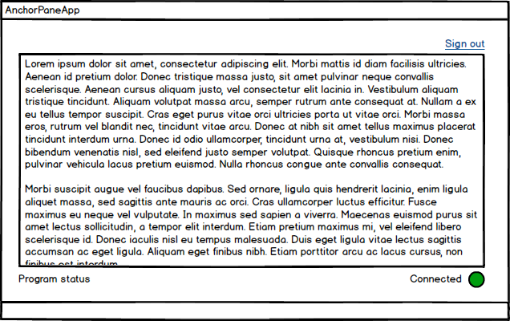
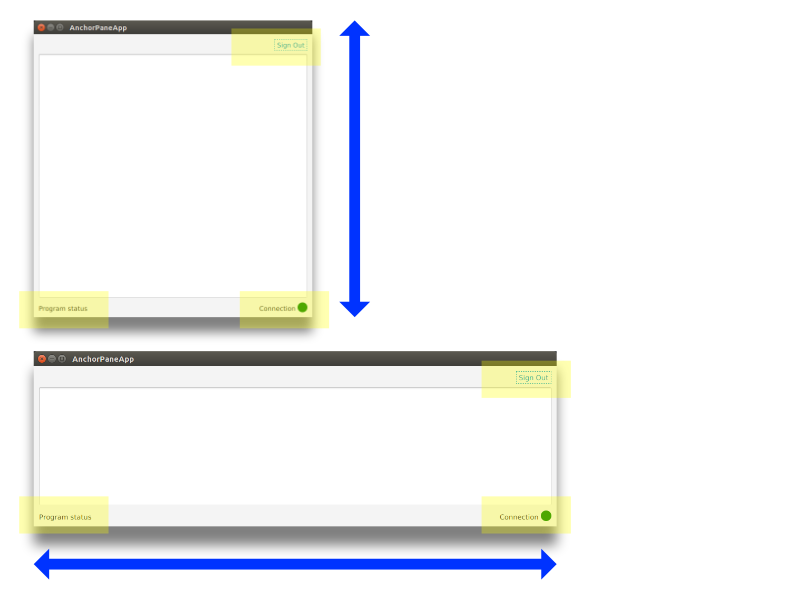

# AnchorPane

AnchorPane 是一个容器控件，它根据边来定义它的布局。当放置在容器中时，AnchorPane 会拉伸以填充可用空间。AnchorPane 的子元素用距离边的距离表示它们的位置和大小: Top, Left, Bottom, Right。如果将一个或两个锚设置放置在AnchorPane 子节点上，则子节点将固定在窗口的那个角落。如果使用了两个以上的锚点设置，子节点将被拉伸以填充可用的水平和垂直空间。

这个模型显示了一个被一组控件包围的 TextArea :一个超链接和两个状态指示器。由于 TextArea 将包含所有内容，因此它最初应该占用大部分空间，并且应该从调整大小中获得任何额外的空间。在外围，右上方有一个 Hyperlink，右下方有一个连接标签和 Circle，左下方有一个状态标签。



## Anchors

为了开始布局，创建一个 AnchorPane 对象并将其添加到场景中。

```java
AnchorPane ap = new AnchorPane();
Scene scene = new Scene(ap);
```

锚是使用 AnchorPane 类的静态方法设置的。这些方法(每个边一个)接受节点和偏移量。对于超链接，将设置一个上边缘的锚点和一个右边缘的锚点。为每条边设置 10.0 的偏移量，这样链路就不会被压缩到另一边。

```java
Hyperlink signoutLink = new Hyperlink("Sign Out");

ap.getChildren().add( signoutLink );

AnchorPane.setTopAnchor( signoutLink, 10.0d );
AnchorPane.setRightAnchor( signoutLink, 10.0d );
```

当屏幕大小调整时，AnchorPane 将调整大小，而 signoutLink 将保持其右上角的位置。因为没有指定左锚和底锚，所以不会拉伸 signoutLink。

接下来，添加连接标签和圆圈。这些控件被包装在一个 HBox 中。

```java
Circle circle = new Circle();
circle.setFill(Color.GREEN );
circle.setRadius(10);

Label connLabel = new Label("Connection");

HBox connHBox = new HBox();
connHBox.setSpacing( 4.0d );
connHBox.setAlignment(Pos.BOTTOM_RIGHT);
connHBox.getChildren().addAll( connLabel, circle );

AnchorPane.setBottomAnchor( connHBox, 10.0d );
AnchorPane.setRightAnchor( connHBox, 10.0d );

ap.getChildren().add( connHBox );
```

与 signoutLink 一样，connHBox 固定在屏幕上的某个位置。connHBox 设置为距离下边缘10像素，距离右边缘10像素。

添加左下角的状态“标签”。左锚和底锚设置好了。

```java
Label statusLabel = new Label("Program status");
ap.getChildren().add( statusLabel );

AnchorPane.setBottomAnchor( statusLabel, 10.0d );
AnchorPane.setLeftAnchor( statusLabel, 10.0d );
```

这是完成的应用程序的截图。状态和控制标签在屏幕的底部，分别固定在左边和右边的边缘。超链接固定在右上角。


## 调整大小

外围控件的大小可能不同。例如，状态消息或连接消息可能更长。但是，通过将左下角的状态标签扩展到右边，并将右下角的连接状态标签扩展到左边，可以在这个布局中容纳额外的长度。使用此布局调整大小将绝对移动这些控件，但它们将坚持各自的边缘加上偏移量。

这不是 TextArea 的情况。因为 TextArea 可能包含很多内容，它应该接收用户给窗口的任何额外空间。此控件将锚定到AnchorPane 的所有四个角。这将导致 TextArea 在窗口调整大小时调整大小。TextArea 固定在左上角，当用户将窗口手柄拖到右下角时，TextArea 的右下角也会移动。

该图显示了两次调整大小操作的结果。顶部的截图是通过向下拖动窗口底部边缘来垂直调整大小的。底部的截图是通过拖动窗口的右边缘来水平调整大小的。



突出显示的框表示与 TextArea 接壤的控件保持相对于边缘的位置。TextArea 本身根据窗口大小调整大小。TextArea 的顶部和底部偏移量用于其他控件，因此它们不会被隐藏。

```java
TextArea ta = new TextArea();

AnchorPane.setTopAnchor( ta, 40.0d );
AnchorPane.setBottomAnchor( ta, 40.0d );
AnchorPane.setRightAnchor( ta, 10.0d );
AnchorPane.setLeftAnchor( ta, 10.0d );

ap.getChildren().add( ta );
```

当你同时拥有可调整大小和固定位置的子元素时，AnchorPane 是一个不错的选择。如果只有一个子控件需要调整大小，则首选带有优先级设置的其他控件，如 VBox 和 HBox。使用这些控件，而不是带有设置了所有四个锚的子控件的 AnchorPane。记住，要在子类上设置锚，需要使用容器类的静态方法，如 AnchorPane.setTopAnchor()。

## 完整代码

以下是 AnchorPane 示例的完整代码。

```java
public class AnchorPaneApp extends Application {

    @Override
    public void start(Stage primaryStage) throws Exception {

        AnchorPane ap = new AnchorPane();

        // upper-right sign out control
        Hyperlink signoutLink = new Hyperlink("Sign Out");

        ap.getChildren().add( signoutLink );

        AnchorPane.setTopAnchor( signoutLink, 10.0d );
        AnchorPane.setRightAnchor( signoutLink, 10.0d );

        // lower-left status label
        Label statusLabel = new Label("Program status");
        ap.getChildren().add( statusLabel );

        AnchorPane.setBottomAnchor( statusLabel, 10.0d );
        AnchorPane.setLeftAnchor( statusLabel, 10.0d );

        // lower-right connection status control
        Circle circle = new Circle();
        circle.setFill(Color.GREEN );
        circle.setRadius(10);

        Label connLabel = new Label("Connection");

        HBox connHBox = new HBox();
        connHBox.setSpacing( 4.0d );
        connHBox.setAlignment(Pos.BOTTOM_RIGHT);
        connHBox.getChildren().addAll( connLabel, circle );

        AnchorPane.setBottomAnchor( connHBox, 10.0d );
        AnchorPane.setRightAnchor( connHBox, 10.0d );

        ap.getChildren().add( connHBox );

        // top-left content; takes up extra space
        TextArea ta = new TextArea();
        ap.getChildren().add( ta );

        AnchorPane.setTopAnchor( ta, 40.0d );
        AnchorPane.setBottomAnchor( ta, 40.0d );
        AnchorPane.setRightAnchor( ta, 10.0d );
        AnchorPane.setLeftAnchor( ta, 10.0d );

        Scene scene = new Scene(ap);

        primaryStage.setTitle("AnchorPaneApp");
        primaryStage.setScene( scene );
        primaryStage.setWidth(568);
        primaryStage.setHeight(320);
        primaryStage.show();
    }

    public static void main(String[] args) {
        launch(args);
    }
}
```

