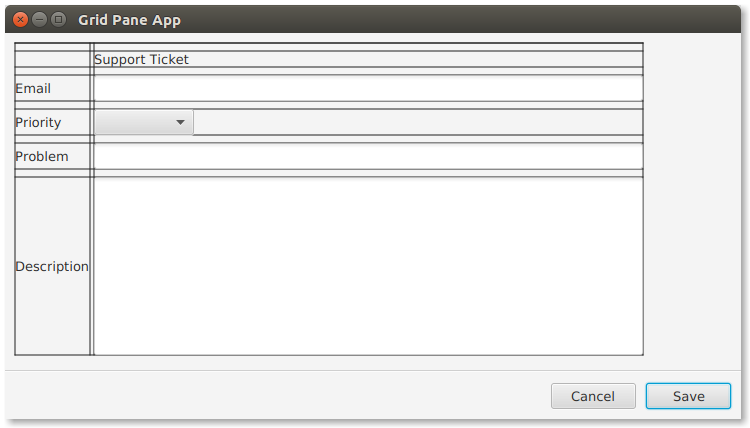

# GridPane

业务应用程序中的表单通常使用模仿数据库记录的布局。对于表中的每一列，在左侧添加一个标题，该标题与右侧的行值相匹配。JavaFX 有一个特殊用途的控件，称为 GridPane，用于这种类型的布局，它使内容按行和列对齐。GridPane 还支持生成更复杂的布局。

这个截图显示了一个基本的 GridPane 布局。在表单的左侧，有一列字段名称：Email, Priority, Problem, Description。在表单的右侧，有一列控件，将显示相应字段的值。字段名的类型是Label，值控件是混合的，包括 TextField、TextArea 和ComboBox。


下面的代码显示了为表单创建的对象。“vbox” 是场景的根，也将包含窗体底部的按钮栏。

```java
VBox vbox = new VBox();

GridPane gp = new GridPane();

Label lblTitle = new Label("Support Ticket");

Label lblEmail = new Label("Email");
TextField tfEmail = new TextField();

Label lblPriority = new Label("Priority");
ObservableList<String> priorities = FXCollections.observableArrayList("Medium", "High", "Low");
ComboBox<String> cbPriority = new ComboBox<>(priorities);

Label lblProblem = new Label("Problem");
TextField tfProblem = new TextField();

Label lblDescription = new Label("Description");
TextArea taDescription = new TextArea();
```

GridPane 有一个方便的方法  setGridLinesVisible()  来显示网格结构和沟槽。它在涉及生成的更复杂的布局中特别有用，因为行/栏分配中的间隙可能导致布局的变化。



## 间距

作为一个容器，GridPane 有一个填充属性，可以设置为用空白包围 GridPane 内容。"padding" 将以 Inset 对象作为参数。在本例中，10 个像素的空白被应用到所有的边，因此Inset使用了一个简短的表单构造函数。

在 GridPane 中，vgap 和 hgap 控制排水沟。hgap 被设置为 4，以保持字段接近它们的值。Vgap 稍微大一些，以帮助鼠标导航。

```java
gp.setPadding( new Insets(10) );
gp.setHgap( 4 );
gp.setVgap( 8 );
```

为了保持表单下部的一致性，在 VBox 上设置了一个优先级。但是，这不会调整单个行的大小。对于单独的调整大小规格，使用 ColumnConstraints 和 RowConstraints。

```java
VBox.setVgrow(gp, Priority.ALWAYS );
```

## 添加子项

不像像 BorderPane 或 HBox 这样的容器，节点需要指定它们在 GridPane 中的位置。这是通过 GridPane 上的add()方法完成的，而不是容器子属性上的add方法。这种形式的 GridPane add() 方法接受从零开始的列位置和从零开始的行位置。为了便于阅读，这段代码将两条语句放在同一行。

```java
gp.add( lblTitle,       1, 1);  // empty item at 0,0
gp.add( lblEmail,       0, 2); gp.add(tfEmail,        1, 2);
gp.add( lblPriority,    0, 3); gp.add( cbPriority,    1, 3);
gp.add( lblProblem,     0, 4); gp.add( tfProblem,     1, 4);
gp.add( lblDescription, 0, 5); gp.add( taDescription, 1, 5);
```

lblTitle 放在第一行的第二列中。在第一行的第一列中没有条目。

后续添加的内容成对呈现。字段名 Label 对象放在第一列(列索引=0)，值控件放在第二列(列索引=1)。行通过第二个值的增量来添加。例如，lblPriority 和它的 ComboBox 一起放在第四行。

GridPane 是 JavaFX 业务应用程序设计中的一个重要容器。当您需要名称/值对时，GridPane 将是支持传统表单的强列定向的一种简单方法。

## 完整代码

下面的类是示例的完整代码。这包括 ButtonBar 的定义，在前面关注 GridPane 的部分中没有介绍这个定义。

```java
public class GridPaneApp extends Application {

    @Override
    public void start(Stage primaryStage) throws Exception {

        VBox vbox = new VBox();

        GridPane gp = new GridPane();
        gp.setPadding( new Insets(10) );
        gp.setHgap( 4 );
        gp.setVgap( 8 );

        VBox.setVgrow(gp, Priority.ALWAYS );

        Label lblTitle = new Label("Support Ticket");

        Label lblEmail = new Label("Email");
        TextField tfEmail = new TextField();

        Label lblPriority = new Label("Priority");
        ObservableList<String> priorities =
            FXCollections.observableArrayList("Medium", "High", "Low");
        ComboBox<String> cbPriority = new ComboBox<>(priorities);

        Label lblProblem = new Label("Problem");
        TextField tfProblem = new TextField();

        Label lblDescription = new Label("Description");
        TextArea taDescription = new TextArea();

        gp.add( lblTitle,       1, 1);  // empty item at 0,0
        gp.add( lblEmail,       0, 2); gp.add(tfEmail,        1, 2);
        gp.add( lblPriority,    0, 3); gp.add( cbPriority,    1, 3);
        gp.add( lblProblem,     0, 4); gp.add( tfProblem,     1, 4);
        gp.add( lblDescription, 0, 5); gp.add( taDescription, 1, 5);

        Separator sep = new Separator(); // hr

        ButtonBar buttonBar = new ButtonBar();
        buttonBar.setPadding( new Insets(10) );

        Button saveButton = new Button("Save");
        Button cancelButton = new Button("Cancel");

        buttonBar.setButtonData(saveButton, ButtonBar.ButtonData.OK_DONE);
        buttonBar.setButtonData(cancelButton, ButtonBar.ButtonData.CANCEL_CLOSE);

        buttonBar.getButtons().addAll(saveButton, cancelButton);

        vbox.getChildren().addAll( gp, sep, buttonBar );

        Scene scene = new Scene(vbox);

        primaryStage.setTitle("Grid Pane App");
        primaryStage.setScene(scene);
        primaryStage.setWidth( 736 );
        primaryStage.setHeight( 414  );
        primaryStage.show();

    }

    public static void main(String[] args) {
        launch(args);
    }
}
```

