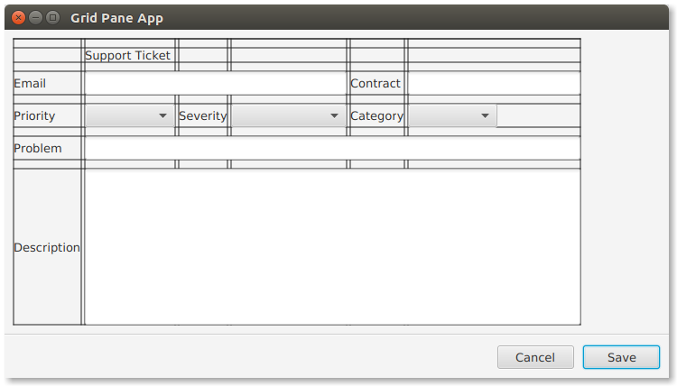

# GridPane Spanning

对于使用 GridPane 实现的更复杂的表单，支持生成。生成允许控件声明相邻列 (colspan) 和相邻行 (rowspan) 的空间。这个屏幕截图显示了一个表单，它扩展了前一节中的示例。早期版本的两列布局已被多列布局所取代。像 Problem 和Description 这样的字段保留了原来的结构。但是控件被添加到以前只包含电子邮件和优先级的行中。


打开网格线，注意原来的两列网格被替换为六列网格。第三行包含 6 个项—— 3 个字段名/值对——指示结构。表单的其余部分将使用生成来填充空白。



在此更新中使用的 VBox 和 GridPane 容器对象如下。还有一点 Vgap 来帮助用户选择 ComboBox 控件。

```java
GridPane gp = new GridPane();
gp.setPadding( new Insets(10) );
gp.setHgap( 4 );
gp.setVgap( 10 );

VBox.setVgrow(gp, Priority.ALWAYS );
```

这些是更新后的示例中的控件创建语句。

```java
Label lblTitle = new Label("Support Ticket");

Label lblEmail = new Label("Email");
TextField tfEmail = new TextField();

Label lblContract = new Label("Contract");
TextField tfContract = new TextField();

Label lblPriority = new Label("Priority");
ObservableList<String> priorities =
    FXCollections.observableArrayList("Medium", "High", "Low");
ComboBox<String> cbPriority = new ComboBox<>(priorities);

Label lblSeverity = new Label("Severity");
ObservableList<String> severities =
    FXCollections.observableArrayList("Blocker", "Workaround", "N/A");
ComboBox<String> cbSeverity = new ComboBox<>(severities);

Label lblCategory = new Label("Category");
ObservableList<String> categories =
    FXCollections.observableArrayList("Bug", "Feature");
ComboBox<String> cbCategory = new ComboBox<>(categories);

Label lblProblem = new Label("Problem");
TextField tfProblem = new TextField();

Label lblDescription = new Label("Description");
TextArea taDescription = new TextArea();
```

与早期版本一样，使用 add() 方法将控件添加到 GridPane。指定列和行。在这个代码片段中，索引并不简单，因为有一些空白需要通过生成内容来填补。

```java
gp.add( lblTitle,       1, 0);  // empty item at 0,0

gp.add( lblEmail,       0, 1);
gp.add(tfEmail,         1, 1);
gp.add( lblContract,    4, 1 );
gp.add( tfContract,     5, 1 );

gp.add( lblPriority,    0, 2);
gp.add( cbPriority,     1, 2);
gp.add( lblSeverity,    2, 2);
gp.add( cbSeverity,     3, 2);
gp.add( lblCategory,    4, 2);
gp.add( cbCategory,     5, 2);

gp.add( lblProblem,     0, 3); gp.add( tfProblem,     1, 3);
gp.add( lblDescription, 0, 4); gp.add( taDescription, 1, 4);
```

最后，使用 GridPane 上的静态方法设置生成定义。有一个类似的方法来做行生成。标题将占用 5 列将问题和描述。电子邮件与合同共享一行，但会占用更多的列。combobox 的第三行是由三个字段/值对组成的一组，每个字段/值对占一列。

```java
GridPane.setColumnSpan( lblTitle, 5 );
GridPane.setColumnSpan( tfEmail, 3 );
GridPane.setColumnSpan( tfProblem, 5 );
GridPane.setColumnSpan( taDescription, 5 );
```

或者，add() 方法的一个变体将使用 columnSpan 和 rowSpan 参数来避免后续的静态方法调用。

这个扩展的 GridPane 示例演示了列生成。同样的功能也可用于行生成，这将允许控件声明额外的垂直空间。即使在给定行(或列)中的项数变化的情况下，生成也使控件保持对齐。为了将重点放在跨越主题上，这个网格允许列的宽度变化。关于 ColumnConstraints 和 RowConstraints 的文章将着重于通过更好地控制列(和行)来构建真正的模块化和列排版网格。

## 完整代码

下面是生成 GridPane 示例的完整代码。

```java
public class ComplexGridPaneApp extends Application {

    @Override
    public void start(Stage primaryStage) throws Exception {

        VBox vbox = new VBox();

        GridPane gp = new GridPane();
        gp.setPadding( new Insets(10) );
        gp.setHgap( 4 );
        gp.setVgap( 10 );

        VBox.setVgrow(gp, Priority.ALWAYS );

        Label lblTitle = new Label("Support Ticket");

        Label lblEmail = new Label("Email");
        TextField tfEmail = new TextField();

        Label lblContract = new Label("Contract");
        TextField tfContract = new TextField();

        Label lblPriority = new Label("Priority");
        ObservableList<String> priorities =
            FXCollections.observableArrayList("Medium", "High", "Low");
        ComboBox<String> cbPriority = new ComboBox<>(priorities);

        Label lblSeverity = new Label("Severity");
        ObservableList<String> severities = FXCollections.observableArrayList("Blocker", "Workaround", "N/A");
        ComboBox<String> cbSeverity = new ComboBox<>(severities);

        Label lblCategory = new Label("Category");
        ObservableList<String> categories = FXCollections.observableArrayList("Bug", "Feature");
        ComboBox<String> cbCategory = new ComboBox<>(categories);

        Label lblProblem = new Label("Problem");
        TextField tfProblem = new TextField();

        Label lblDescription = new Label("Description");
        TextArea taDescription = new TextArea();

        gp.add( lblTitle,       1, 0);  // empty item at 0,0

        gp.add( lblEmail,       0, 1);
        gp.add(tfEmail,         1, 1);
        gp.add( lblContract,    4, 1 );
        gp.add( tfContract,     5, 1 );

        gp.add( lblPriority,    0, 2);
        gp.add( cbPriority,     1, 2);
        gp.add( lblSeverity,    2, 2);
        gp.add( cbSeverity,     3, 2);
        gp.add( lblCategory,    4, 2);
        gp.add( cbCategory,     5, 2);

        gp.add( lblProblem,     0, 3); gp.add( tfProblem,     1, 3);
        gp.add( lblDescription, 0, 4); gp.add( taDescription, 1, 4);

        GridPane.setColumnSpan( lblTitle, 5 );
        GridPane.setColumnSpan( tfEmail, 3 );
        GridPane.setColumnSpan( tfProblem, 5 );
        GridPane.setColumnSpan( taDescription, 5 );

        Separator sep = new Separator(); // hr

        ButtonBar buttonBar = new ButtonBar();
        buttonBar.setPadding( new Insets(10) );

        Button saveButton = new Button("Save");
        Button cancelButton = new Button("Cancel");

        buttonBar.setButtonData(saveButton, ButtonBar.ButtonData.OK_DONE);
        buttonBar.setButtonData(cancelButton, ButtonBar.ButtonData.CANCEL_CLOSE);

        buttonBar.getButtons().addAll(saveButton, cancelButton);

        vbox.getChildren().addAll( gp, sep, buttonBar );

        Scene scene = new Scene(vbox);

        primaryStage.setTitle("Grid Pane App");
        primaryStage.setScene(scene);
        primaryStage.setWidth( 736 );
        primaryStage.setHeight( 414  );
        primaryStage.show();

    }

    public static void main(String[] args) {
        launch(args);
    }
}
```

