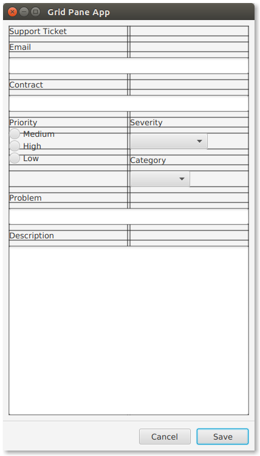

# GridPane 行约束和列约束

以前关于 GridPane 的文章展示了如何创建一个两列布局，左边是字段名，右边是字段值。对该示例进行了扩展，以便向给定行添加更多控件，并使用跨越处理内容中的间隙。本文介绍了一对 JavaFX 类 ColumnConstraints 和RowConstraints。这些类为行或列提供了额外的规范。在这个例子中，当窗口调整大小时，包含 TextArea 的行将被赋予所有额外的空间。这两列将被设置为相等的宽度。

这个屏幕截图显示了一个修改自前几篇文章的示例。本文的演示程序有一种旋转的感觉，即字段名与字段值是垂直(在值的顶部)而不是水平配对的。行生成和列生成用于对齐大于单个单元格的项。


红色矩形和文本不是 UI 的一部分。它们正在标识屏幕的各个部分，这些部分稍后将使用 ColumnConstraints 和rowconstraints 来解决。

这段代码是创建场景根和 GridPane 对象。

```java
VBox vbox = new VBox();

GridPane gp = new GridPane();
gp.setPadding( new Insets(10) );
gp.setHgap( 4 );
gp.setVgap( 10 );

VBox.setVgrow(gp, Priority.ALWAYS );
```

这段代码创建本文中使用的 UI 控件对象。注意，Priority 现在被实现为包含 RadioButtons 的 VBox。

```java
Label lblTitle = new Label("Support Ticket");

Label lblEmail = new Label("Email");
TextField tfEmail = new TextField();

Label lblContract = new Label("Contract");
TextField tfContract = new TextField();

Label lblPriority = new Label("Priority");
RadioButton rbMedium = new RadioButton("Medium");
RadioButton rbHigh = new RadioButton("High");
RadioButton rbLow = new RadioButton("Low");
VBox priorityVBox = new VBox();
priorityVBox.setSpacing( 2 );
GridPane.setVgrow(priorityVBox, Priority.SOMETIMES);
priorityVBox.getChildren().addAll( lblPriority, rbMedium, rbHigh, rbLow );

Label lblSeverity = new Label("Severity");
ObservableList<String> severities =
    FXCollections.observableArrayList("Blocker", "Workaround", "N/A");
ComboBox<String> cbSeverity = new ComboBox<>(severities);

Label lblCategory = new Label("Category");
ObservableList<String> categories =
    FXCollections.observableArrayList("Bug", "Feature");
ComboBox<String> cbCategory = new ComboBox<>(categories);

Label lblProblem = new Label("Problem");
TextField tfProblem = new TextField();

Label lblDescription = new Label("Description");
TextArea taDescription = new TextArea();
```

电子邮件、合同、问题和描述的标签和值控制对放在一个列中。它们应该采用 GridPane 的全部宽度，因此每个 GridPane的columnSpan 都设置为 2。

```java
GridPane.setColumnSpan( tfEmail, 2 );
GridPane.setColumnSpan( tfContract, 2 );
GridPane.setColumnSpan( tfProblem, 2 );
GridPane.setColumnSpan( taDescription, 2 );
```

新的优先级单选按钮与严重性和类别的四个控件水平匹配。这个 rowSpan 设置指示 JavaFX 将包含 RadioButton 的 VBox放在一个高度为四行的合并单元格中。

```java
GridPane.setRowSpan( priorityVBox, 4 );
```

## 行约束

此时，代码反映了使用行和列生成的示例应用程序中呈现的UI截图。要重新分配表单底部的额外空间，请使用RowConstraints 对象来设置 Priority。总是在 TextArea 的行上。这将导致 TextArea 增长以填充可用空间。


这段代码是 TextArea 的 GridPane 的 RowConstraints 对象。在 setter 之前，为所有其他行分配 RowConstraints 对象。当您指定第 12 行而不首先分配对象时，getRowConstraints() 的 set 方法将抛出索引异常。

```java
RowConstraints taDescriptionRowConstraints = new RowConstraints();
taDescriptionRowConstraints.setVgrow(Priority.ALWAYS);

for( int i=0; i<13; i++ ) {
    gp.getRowConstraints().add( new RowConstraints() );
}

gp.getRowConstraints().set( 12, taDescriptionRowConstraints );
```

作为一种替代语法，GridPane 中有一个 setConstraints() 方法。这将传递几个值，并避免了对 TextArea 的专用columnSpan 集合调用的需要。前面清单中的 RowConstraints 代码将不会出现在完成的程序中。

```java
gp.setConstraints(taDescription,
                  0, 12,
                  2, 1,
                  HPos.LEFT, VPos.TOP,
                  Priority.SOMETIMES, Priority.ALWAYS);
```

这段代码标识了(0,12)处的节点，即 TextArea。TextArea 将跨越2列，但只有 1 行。hpo 和 vpo 设置在左上角。最后，hgrow的优先级是 SOMETIMES, vgrow 的优先级是 ALWAYS。由于 TextArea 是唯一带有 “ALWAYS”  的行，它将获得额外的空间。如果有其他ALWAYS设置，则该空间将在多行之间共享。

## 列约束

为了正确分配 Severity 和 Category 控件周围的空间，需要指定 ColumnConstraints。默认行为为第一列分配较少的空间，因为 Priority RadioButtons 较小。下面的线框显示了期望的布局，它具有相等的列，由 4 像素 (Hgap) 分隔。



要使列宽度相等，请定义两个 ColumnConstraint 对象并使用百分比说明符。

```java
ColumnConstraints col1 = new ColumnConstraints();
col1.setPercentWidth( 50 );
ColumnConstraints col2 = new ColumnConstraints();
col2.setPercentWidth( 50 );
gp.getColumnConstraints().addAll( col1, col2 );
```

这是完成的示例的屏幕截图。


GridPane 是开发 JavaFX 业务应用程序的一个重要控件。当处理涉及名称/值对和单个记录视图的需求时，请使用 GridPane。虽然 GridPane比 Swing 中的 griddbaglayout 更容易使用，但我仍然发现 API 有点不方便(分配自己的索引，解除关联的约束)。幸运的是，Scene Builder 极大地简化了这个表单的构造。

## 完整代码

下面是约束 GridPane 示例的完整代码。

```java
public class ConstraintsGridPaneApp extends Application {

    @Override
    public void start(Stage primaryStage) throws Exception {

        VBox vbox = new VBox();

        GridPane gp = new GridPane();
        gp.setPadding( new Insets(10) );
        gp.setHgap( 4 );
        gp.setVgap( 10 );

        VBox.setVgrow(gp, Priority.ALWAYS );

        Label lblTitle = new Label("Support Ticket");

        Label lblEmail = new Label("Email");
        TextField tfEmail = new TextField();

        Label lblContract = new Label("Contract");
        TextField tfContract = new TextField();

        Label lblPriority = new Label("Priority");
        RadioButton rbMedium = new RadioButton("Medium");
        RadioButton rbHigh = new RadioButton("High");
        RadioButton rbLow = new RadioButton("Low");
        VBox priorityVBox = new VBox();
        priorityVBox.setSpacing( 2 );
        GridPane.setVgrow(priorityVBox, Priority.SOMETIMES);
        priorityVBox.getChildren().addAll( lblPriority, rbMedium, rbHigh, rbLow );

        Label lblSeverity = new Label("Severity");
        ObservableList<String> severities = FXCollections.observableArrayList("Blocker", "Workaround", "N/A");
        ComboBox<String> cbSeverity = new ComboBox<>(severities);

        Label lblCategory = new Label("Category");
        ObservableList<String> categories = FXCollections.observableArrayList("Bug", "Feature");
        ComboBox<String> cbCategory = new ComboBox<>(categories);

        Label lblProblem = new Label("Problem");
        TextField tfProblem = new TextField();

        Label lblDescription = new Label("Description");
        TextArea taDescription = new TextArea();

        gp.add( lblTitle,       0, 0);

        gp.add( lblEmail,       0, 1);
        gp.add(tfEmail,         0, 2);

        gp.add( lblContract,    0, 3 );
        gp.add( tfContract,     0, 4 );

        gp.add( priorityVBox,   0, 5);

        gp.add( lblSeverity,    1, 5);
        gp.add( cbSeverity,     1, 6);
        gp.add( lblCategory,    1, 7);
        gp.add( cbCategory,     1, 8);

        gp.add( lblProblem,     0, 9);
        gp.add( tfProblem,      0, 10);

        gp.add( lblDescription, 0, 11);
        gp.add( taDescription,  0, 12);

        GridPane.setColumnSpan( tfEmail, 2 );
        GridPane.setColumnSpan( tfContract, 2 );
        GridPane.setColumnSpan( tfProblem, 2 );

        GridPane.setRowSpan( priorityVBox, 4 );

        gp.setConstraints(taDescription,
                          0, 12,
                          2, 1,
                          HPos.LEFT, VPos.TOP,
                          Priority.SOMETIMES, Priority.ALWAYS);

        ColumnConstraints col1 = new ColumnConstraints();
        col1.setPercentWidth( 50 );
        ColumnConstraints col2 = new ColumnConstraints();
        col2.setPercentWidth( 50 );
        gp.getColumnConstraints().addAll( col1, col2 );

        Separator sep = new Separator(); // hr

        ButtonBar buttonBar = new ButtonBar();
        buttonBar.setPadding( new Insets(10) );

        Button saveButton = new Button("Save");
        Button cancelButton = new Button("Cancel");

        buttonBar.setButtonData(saveButton, ButtonBar.ButtonData.OK_DONE);
        buttonBar.setButtonData(cancelButton, ButtonBar.ButtonData.CANCEL_CLOSE);

        buttonBar.getButtons().addAll(saveButton, cancelButton);

        vbox.getChildren().addAll( gp, sep, buttonBar );

        Scene scene = new Scene(vbox);

        primaryStage.setTitle("Grid Pane App");
        primaryStage.setScene(scene);
        primaryStage.setWidth( 414 );
        primaryStage.setHeight( 736  );
        primaryStage.show();

    }

    public static void main(String[] args) {
        launch(args);
    }
}
```

