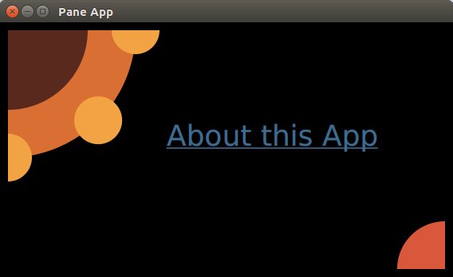
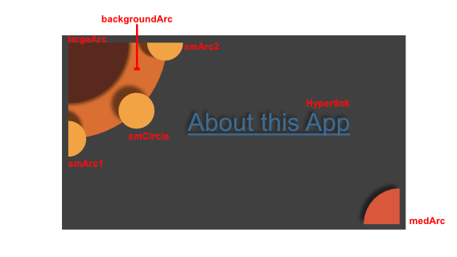

# Pane的绝对定位

像 VBox 或 BorderPane 这样的容器会对齐并分布它们的子节点。超类 Pane 也是一个容器，但不会对它的子类施加顺序。子节点通过 x、centerX  和 layoutX 等属性来定位自己。这被称为绝对定位，它是一种将形状或节点放置在屏幕上特定位置的技术。

这个屏幕截图显示了一个 About 视图。About 视图在屏幕中间有一个超链接 “About this App”。About 视图使用几个JavaFX 形状来形成一个设计，它被裁剪成一张名片。



## Pane的大小

与大多数容器不同，窗格调整大小以适合其内容，而不是相反。这张照片是在添加右下方弧线之前从风景视图中截取的截图。窗格是黄色突出显示的区域。注意，它并没有占据整个阶段。


这是添加右下角圆弧后的截图。这个圆弧靠近舞台的右下边缘。这将迫使窗格进行拉伸以容纳展开的内容。


## Pane

About 视图的最外层容器是一个 VBox，其唯一的内容是窗格。VBox 用于适应整个舞台并提供背景。

```java
VBox vbox = new VBox();
vbox.setPadding( new Insets( 10 ) );
vbox.setBackground(
    new Background(
        new BackgroundFill(Color.BLACK, new CornerRadii(0), new Insets(0))
        ));

Pane p = new Pane();
```

## The Shapes

在屏幕的左上角，有一组 4 个“弧”和 1 个“圆”。这段代码通过 Arc 构造函数中的 centerX 和 centerY 参数将 largeArc 定位在 (0,0) 处。注意 backgroundArc 也位于(0,0)，并出现在 largeArc 的下方。窗格不试图消除重叠形状的冲突，在这种情况下，重叠是需要的。smArc1 位于(0,160)，在Y轴上向下。smArc2 位于(160,0)，正好在 X 轴上。smCircle 的位置与smArc1和smArc2的距离相同，但角度为 45 度。

```java
Arc largeArc = new Arc(0, 0, 100, 100, 270, 90);
largeArc.setType(ArcType.ROUND);

Arc backgroundArc = new Arc(0, 0, 160, 160, 270, 90 );
backgroundArc.setType( ArcType.ROUND );

Arc smArc1 = new Arc( 0, 160, 30, 30, 270, 180);
smArc1.setType(ArcType.ROUND);

Circle smCircle = new Circle(160/Math.sqrt(2.0), 160/Math.sqrt(2.0), 30,Color.web("0xF2A444"));

Arc smArc2 = new Arc( 160, 0, 30, 30, 180, 180);
smArc2.setType(ArcType.ROUND);
```

右下方的圆弧是根据舞台的整体高度来定位的。从高度中减去的 20 是 VBox 的 10 像素 Insets (左侧 10 + 右侧 10)。

```java
Arc medArc = new Arc(568-20, 320-20, 60, 60, 90, 90);
medArc.setType(ArcType.ROUND);

primaryStage.setWidth( 568 );
primaryStage.setHeight( 320 );
```

## 超链接

超链接的位置偏移中心 (284,160)，这是舞台的宽度和高度都除以 2。这会将超链接的文本定位在屏幕的右下象限，因此需要根据超链接的宽度和高度进行偏移。在显示屏幕之前，超链接的尺寸是不可用的，所以我在显示后对位置进行了调整。

```java
Hyperlink hyperlink = new Hyperlink("About this App");

primaryStage.setOnShown( (evt) -> {
     hyperlink.setLayoutX( 284 - (hyperlink.getWidth()/3) );
     hyperlink.setLayoutY( 160 - hyperlink.getHeight() );
});
```

超链接没有被放置在屏幕的真正中心。layoutX 值基于将其从左上角设计移开的除以 3 操作。

## Z-Order

如前所述，Pane 支持重叠的子节点。该图显示了左上角设计中添加深度的 About 视图。较小的 arc 和 Circle 与较大的 arc 一样悬浮在背景 arc 之上。



在这个例子中，z 轴顺序是由子元素添加到窗格的顺序决定的。背景 arc 被后来添加的物品所掩盖，最明显的是 largeArc。要重新排列子元素，请在项目添加到窗格后使用 toFront() 和 toBack() 方法。

```java
p.getChildren().addAll( backgroundArc, largeArc, smArc1, smCircle, smArc2, hyperlink, medArc );

vbox.getChildren().add( p );
```

在启动 JavaFX 时，很容易构建一个绝对布局。请注意，绝对布局是脆弱的，当屏幕调整大小或在软件维护阶段添加项目时，通常会损坏。然而，使用绝对定位有很好的理由。游戏就是这样一种用法。在游戏中，你可以调整“形状”的 (x,y) 坐标，在屏幕上移动游戏部件。本文演示了 JavaFX 类 Pane，它为任何形状驱动的 UI 提供绝对定位。

## 完整代码

这是完整的 JavaFX Application 子类和主类。

```java
public class PaneApp extends Application {

    @Override
    public void start(Stage primaryStage) throws Exception {

        VBox vbox = new VBox();
        vbox.setPadding( new Insets( 10 ) );
        vbox.setBackground(
            new Background(
                new BackgroundFill(Color.BLACK, new CornerRadii(0), new Insets(0))
                ));

        Pane p = new Pane();

        Arc largeArc = new Arc(0, 0, 100, 100, 270, 90);
        largeArc.setFill(Color.web("0x59291E"));
        largeArc.setType(ArcType.ROUND);

        Arc backgroundArc = new Arc(0, 0, 160, 160, 270, 90 );
        backgroundArc.setFill( Color.web("0xD96F32") );
        backgroundArc.setType( ArcType.ROUND );

        Arc smArc1 = new Arc( 0, 160, 30, 30, 270, 180);
        smArc1.setFill(Color.web("0xF2A444"));
        smArc1.setType(ArcType.ROUND);

        Circle smCircle = new Circle(
            160/Math.sqrt(2.0), 160/Math.sqrt(2.0), 30,Color.web("0xF2A444")
            );

        Arc smArc2 = new Arc( 160, 0, 30, 30, 180, 180);
        smArc2.setFill(Color.web("0xF2A444"));
        smArc2.setType(ArcType.ROUND);

        Hyperlink hyperlink = new Hyperlink("About this App");
        hyperlink.setFont( Font.font(36) );
        hyperlink.setTextFill( Color.web("0x3E6C93") );
        hyperlink.setBorder( Border.EMPTY );

        Arc medArc = new Arc(568-20, 320-20, 60, 60, 90, 90);
        medArc.setFill(Color.web("0xD9583B"));
        medArc.setType(ArcType.ROUND);

        p.getChildren().addAll( backgroundArc, largeArc, smArc1, smCircle,
            smArc2, hyperlink, medArc );

        vbox.getChildren().add( p );

        Scene scene = new Scene(vbox);
        scene.setFill(Color.BLACK);

        primaryStage.setTitle("Pane App");
        primaryStage.setScene( scene );
        primaryStage.setWidth( 568 );
        primaryStage.setHeight( 320 );
        primaryStage.setOnShown( (evt) -> {
             hyperlink.setLayoutX( 284 - (hyperlink.getWidth()/3) );
             hyperlink.setLayoutY( 160 - hyperlink.getHeight() );
        });
        primaryStage.show();
    }

    public static void main(String[] args) {
        launch(args);
    }
}
```

