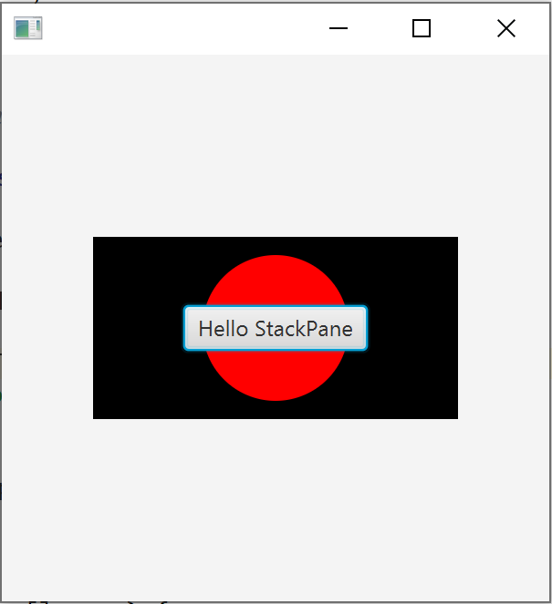
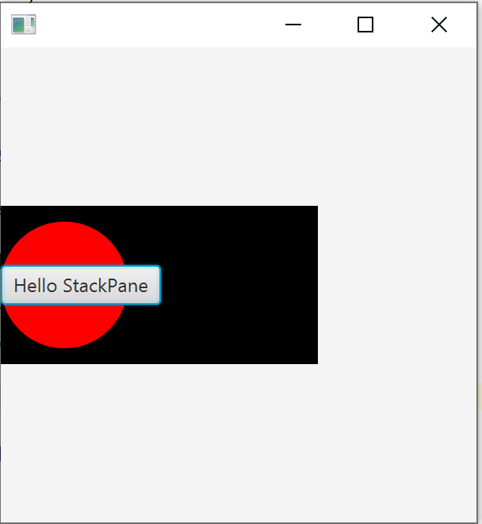

# StackPane

StackPane 将它的子节点一个一个地放在另一个的上面。最后添加的节点是最顶层的。默认情况下，StackPane 将使用 poss . center 对齐子元素，如下图所示，其中 3 个子元素是(按添加的顺序)：矩形，圆形和按钮。



该图像由以下代码片段生成:

```java
public class StackPaneApp extends Application {
    @Override
    public void start(Stage stage) throws Exception {
        StackPane pane = new StackPane(
                new Rectangle(200, 100, Color.BLACK),
                new Circle(40, Color.RED),
                new Button("Hello StackPane")
        );

        stage.setScene(new Scene(pane, 300, 300));
        stage.show();
    }

    public static void main(String[] args) {
        launch(args);
    }
}
```

我们可以通过添加 pane. setalalignment (Pos.CENTER_LEFT) 来改变默认对齐方式;产生以下效果:

