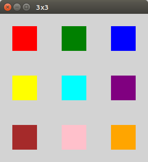
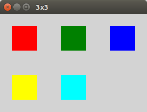
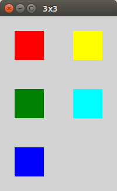
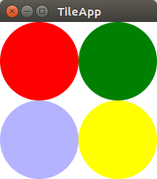

# TilePane

TilePane 用于大小相等的单元格的网格布局。precolumns 和 prefRows 属性定义网格中的行数和列数。要将node添加到TilePane，请访问 children 属性并调用 add() 或 addAll() 方法。这比 GridPane 更容易使用，因为 GridPane 需要显式设置节点的行/列位置。

这个屏幕截图显示了一个定义为 3 × 3 网格的 TilePane。TilePane 包含 9 个矩形对象。


下面是 3 乘 3 网格的完整代码。TilePane 的 children 属性提供了 addAll() 方法，矩形对象可以添加到该方法中。tileAlignment 属性将每个矩形对象定位在其对应贴图的中心。

*ThreeByThreeApp.java*

```java
public class ThreeByThreeApp extends Application {

    @Override
    public void start(Stage primaryStage) throws Exception {

        TilePane tilePane = new TilePane();
        tilePane.setPrefColumns(3);
        tilePane.setPrefRows(3);
        tilePane.setTileAlignment( Pos.CENTER );

        tilePane.getChildren().addAll(
                new Rectangle(50, 50, Color.RED),
                new Rectangle( 50, 50, Color.GREEN ),
                new Rectangle( 50, 50, Color.BLUE ),
                new Rectangle( 50, 50, Color.YELLOW ),
                new Rectangle( 50, 50, Color.CYAN ),
                new Rectangle( 50, 50, Color.PURPLE ),
                new Rectangle( 50, 50, Color.BROWN ),
                new Rectangle( 50, 50, Color.PINK ),
                new Rectangle( 50, 50, Color.ORANGE )
        );

        Scene scene = new Scene(tilePane);
        scene.setFill(Color.LIGHTGRAY);

        primaryStage.setTitle("3x3");
        primaryStage.setScene( scene );
        primaryStage.show();
    }

    public static void main(String[] args) {launch(args);}
}
```

由于 TilePane 的所有 Node 内容都是大小相等的矩形，因此布局被打包在一起，并且 tileAlignment 设置不明显。当tilePrefHeight 和 tilePrefWidth 属性被设置为大于内容时——比如 100x100 块包含 50x50 个矩形——tileAlignment 将决定如何使用额外的空间。

参见下面修改后的ThreeByThreeApp类，它设置了tilepreheight和tileprewidth。

```java
        tilePane.setPrefTileHeight(100);
        tilePane.setPrefTileWidth(100);
```



在前面的屏幕截图中，9 个矩形对象被提供给3乘3的网格。如果内容与 TilePane 定义不匹配，这些单元格将崩溃。这个修改只增加了 5 个矩形，而不是 9 个。第一行包含所有三个磁贴的内容。第二行只包含前两个文件的内容。第三行完全不见了。



有一个属性 “orientation”，它指示 TilePane 逐行(水平，默认)或逐列(垂直)添加项目。如果使用 VERTICAL，那么第一列将有三个元素，第二列将只有前两个元素，第三列将不存在。这个截图显示了5个矩形被添加到3乘3的网格 ( 9 块)，使用垂直方向。



## 算法

可以使用其他容器(如 GridPane、VBox 和 HBox)创建 JavaFX 网格布局。TilePane 是预先定义网格布局的便利工具，它使向网格添加项目成为简单的 add() 或 addAll() 调用。与使用嵌套的 VBox 和 HBox 容器组合构建的网格布局不同，TilePane 内容是直接的子组件。这使得在事件处理期间很容易循环遍历子节点，这有助于实现某些算法。

这个示例应用程序在 tile 窗格中放置了四个圆圈。事件处理程序附加到 TilePane，该 TilePane 查找某个圆圈的选择。如果选择了圆形，则通过不透明度设置使其变暗。如果重新选择圆圈，则恢复其原始颜色。这张截图显示这个应用的蓝色圆圈看起来有点紫色，因为它被选中了。



该程序首先使用 Java 8 流 API 添加项目并设置自定义属性 “selected”。

*TileApp.java*

```java
        TilePane tilePane = new TilePane();
        tilePane.setPrefColumns(2);
        tilePane.setPrefRows(2);
        tilePane.setTileAlignment( Pos.CENTER );

        Circle redCircle = new Circle(50, Color.RED);
        Circle greenCircle = new Circle( 50, Color.GREEN );
        Circle blueCircle = new Circle( 50, Color.BLUE );
        Circle yellowCircle = new Circle( 50, Color.YELLOW );

        List<Circle> circles = new ArrayList<>();
        circles.add( redCircle );
        circles.add( greenCircle );
        circles.add( blueCircle );
        circles.add( yellowCircle );

        circles
                .stream()
                .forEach( (c) -> c.getProperties().put( "selected", Boolean.FALSE ));

        tilePane.getChildren().addAll(
               circles
        );
```

接下来，将事件处理程序附加到鼠标事件。这也是使用 Java 8 Streams。filter() 方法使用 Node.contains() 方法确定是否在转换后的坐标上选择 Circle。如果该表达式通过，findFirst() 将用于检索第一个(在本例中是唯一的)匹配。ifPresent() 中的代码块设置了 “selected” 标志，用于跟踪 Circle 状态并调整不透明度。

*TileApp.java*

```java
    tilePane.setOnMouseClicked(

        (evt) -> tilePane
                    .getChildren()
                    .stream()
                    .filter( c ->
                        c.contains(
                          c.sceneToLocal(evt.getSceneX(), evt.getSceneY(), true)
                        )
                     )
                    .findFirst()
                    .ifPresent(
                            (c) -> {
                                Boolean selected = (Boolean) c.getProperties().get("selected");
                                if( selected == null || selected == Boolean.FALSE ) {
                                    c.setOpacity(0.3d);
                                    c.getProperties().put("selected", Boolean.TRUE);
                                } else {
                                    c.setOpacity( 1.0d );
                                    c.getProperties().put("selected", Boolean.FALSE);
                                }
                            }
                    )
    );
```

## 其他处理

由于程序将圆圈保存在 Java Collections List 中，因此可以用重复的 allAll() 调用替换 TilePane 内容。此事件处理程序由用户在场景中按下 “S” 触发。后备列表的内容被打乱并重新添加到磁贴窗格中。

*TileApp.java*

```java
        scene.setOnKeyPressed(
                (evt) -> {
                    if( evt.getCode().equals(KeyCode.S) ) {
                        Collections.shuffle( circles );
                        tilePane.getChildren().clear();
                        tilePane.getChildren().addAll( circles );
                    }
                }
        );
```

虽然可行，但由于嵌套结构，使用 vbox 和 hbox 构建网格会稍微困难一些。此外，TilePane 不会拉伸内容来填充额外的空间，因此适合出于人体工程学原因需要打包在一起的复合控件。

TilePane 创建大小相等的单元格的网格布局。内容将根据预列、预列和方向设置添加到 tile 窗格中。如果网格包含的 tile多于添加的 node，那么布局中就会出现空白，如果没有提供任何内容，行和列可能会崩溃。这篇文章展示了一对算法，由于 TilePane 简单的接口，它们很容易实现。

## 完整代码

下面是 TileApp 的完整代码。

*TileApp.java *

```java
public class TileApp extends Application {

    @Override
    public void start(Stage primaryStage) throws Exception {

        TilePane tilePane = new TilePane();
        tilePane.setPrefColumns(2);
        tilePane.setPrefRows(2);
        tilePane.setTileAlignment( Pos.CENTER );

        Circle redCircle = new Circle(50, Color.RED);
        Circle greenCircle = new Circle( 50, Color.GREEN );
        Circle blueCircle = new Circle( 50, Color.BLUE );
        Circle yellowCircle = new Circle( 50, Color.YELLOW );

        List<Circle> circles = new ArrayList<>();
        circles.add( redCircle );
        circles.add( greenCircle );
        circles.add( blueCircle );
        circles.add( yellowCircle );

        circles
                .stream()
                .forEach( (c) -> c.getProperties().put( "selected", Boolean.FALSE ));

        tilePane.getChildren().addAll(
               circles
        );

        tilePane.setOnMouseClicked(

            (evt) -> tilePane
                        .getChildren()
                        .stream()
                        .filter( c ->
                            c.contains(
                              c.sceneToLocal(evt.getSceneX(), evt.getSceneY(), true)
                            )
                         )
                        .findFirst()
                        .ifPresent(
                                (c) -> {
                                    Boolean selected = (Boolean) c.getProperties().get("selected");
                                    if( selected == null || selected == Boolean.FALSE ) {
                                        c.setOpacity(0.3d);
                                        c.getProperties().put("selected", Boolean.TRUE);
                                    } else {
                                        c.setOpacity( 1.0d );
                                        c.getProperties().put("selected", Boolean.FALSE);
                                    }
                                }
                        )
        );

        Scene scene = new Scene(tilePane);

        scene.setOnKeyPressed(
                (evt) -> {
                    if( evt.getCode().equals(KeyCode.S) ) {
                        Collections.shuffle( circles );
                        tilePane.getChildren().clear();
                        tilePane.getChildren().addAll( circles );
                    }
                }
        );

        primaryStage.setTitle("TileApp");
        primaryStage.setScene( scene );
        primaryStage.show();

    }

    public static void main(String[] args) {
        launch(args);
    }
}
```

