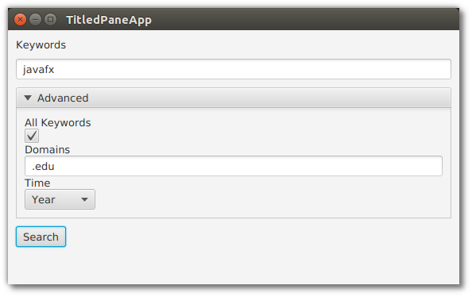

# TitledPane

TitledPane 是一个 Node 容器，它与一个 Label 和一个用于显示和隐藏容器内容的可选控件相匹配。由于 TitledPane 仅限于单个节点，因此它通常与支持多个子节点的容器(如 VBox )配对。从功能上讲，它可以隐藏表单或组相关控件的非必要细节。

这个例子是一个 web 搜索应用程序，它在 TextField 中接受一组关键字。用户按 Search 按钮运行搜索。高级标题窗格展开以提供其他搜索参数。

这个屏幕截图显示了未展开状态，这是执行简单关键字搜索的用户的视图。


下一个屏幕截图显示了需要高级搜索参数的用户的视图。Advanced TitledPane 通过按下 TitledPane 标题中的箭头展开。



要创建 TitledPane，使用构造函数传入一个 String 标题和一个 Node 子节点。也可以使用默认构造函数，并使用 setter 设置标题和 Node。这段代码使用了参数化构造函数。VBox 是 TitledPane 的子元素。然而，VBox 本身包含几个控件。

*TitledPaneApp.java*

```java
        VBox advancedVBox = new VBox(
                new Label("All Keywords"),
                new CheckBox(),
                new Label("Domains"),
                new TextField(),
                new Label("Time"),
                new ComboBox<>(
                    FXCollections.observableArrayList( "Day", "Month", "Year" )
                )
        );

        TitledPane titledPane = new TitledPane(
                "Advanced",
                advancedVBox
        );
        titledPane.setExpanded( false );
```

默认情况下，TitledPane将展开。这不适合隐藏非必要信息的用例，因此在创建对象之后设置扩展属性。

## 可折叠

TitledPane 的另一个属性是可折叠的。默认情况下，TitledPane 可折叠属性设置为 true。但是，可以为不可折叠的控件提供快速分组。下面的屏幕截图演示了这个用例。


这段代码在调用构造函数后设置可折叠标志。

```java
            VBox securityVBox = new VBox(
                    new Label("Owner"),
                    new TextField(),
                    new Label("Access Control"),
                    new TextField()
            );

            TitledPane tp = new TitledPane("Security", securityVBox);
            tp.setCollapsible( false );
```

## 完整代码

下面是第一个演示的完整代码，涉及隐藏的搜索参数 “TitledPaneApp”。

```java
public class TitledPaneApp extends Application {

    @Override
    public void start(Stage primaryStage) throws Exception {

        VBox vbox = new VBox(
                new Label("Keywords" ),
                new TextField()
        );

        vbox.setPadding( new Insets(10) );
        vbox.setSpacing( 10 );

        VBox advancedVBox = new VBox(
                new Label("All Keywords"),
                new CheckBox(),
                new Label("Domains"),
                new TextField(),
                new Label("Time"),
                new ComboBox<>(
                    FXCollections.observableArrayList( "Day", "Month", "Year" )
                )
        );

        TitledPane titledPane = new TitledPane(
                "Advanced",
                advancedVBox
        );
        titledPane.setExpanded( false );

        vbox.getChildren().addAll(
                titledPane,
                new Button("Search")
        );

        Scene scene = new Scene( vbox );

        primaryStage.setTitle( "TitledPaneApp" );
        primaryStage.setScene( scene );
        primaryStage.setWidth( 568 );
        primaryStage.setHeight( 320 );
        primaryStage.show();
    }

    public static void main(String[] args) {
        launch(args);
    }
}
```

