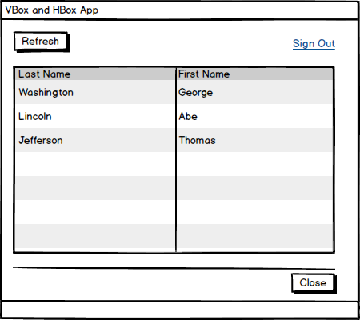
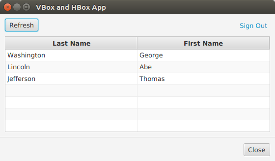

# VBox 和 HBox

JavaFX 中的布局从选择正确的容器控件开始。我最常使用的两个布局控件是 VBox 和 HBox。VBox 是一个在垂直堆栈中排列其子容器。HBox 将其子节点排列在水平行中。这两个控件的强大之处在于对它们进行包装并设置几个关键属性: alignment、hgrow 和 vgrow。

本文将通过一个示例项目演示这些控件。项目的模型显示了一个 UI，如下所示:

- 包含刷新按钮和注销超链接的一行顶部控件，

- TableView 会增长到占用额外的垂直空间

- 关闭按钮。

UI 还具有一个分隔符，它将屏幕的顶部与可能成为应用程序标准的下部面板(保存按钮，取消按钮等)分开。



## 结构

VBox 是最外层的容器 “VBox”。这将是提供给场景的父节点。简单地把UI控件放在这个 VBox 中，将允许控件——最明显的是 TableView ——拉伸以适应可用的水平空间。顶部控件，刷新按钮和注销超链接，被包装在一个 HBox 中。类似地，我将底部的关闭按钮包装在一个 HBox 中，允许添加其他按钮。

```java
VBox vbox = new VBox();

Button btnRefresh = new Button("Refresh");

HBox topRightControls = new HBox();
topRightControls.getChildren().add( signOutLink );

topControls.getChildren().addAll( btnRefresh, topRightControls );

TableView<Customer> tblCustomers = new TableView<>();
Separator sep = new Separator();

HBox bottomControls = new HBox();

Button btnClose = new Button("Close");

bottomControls.getChildren().add( btnClose );

vbox.getChildren().addAll(
        topControls,
        tblCustomers,
        sep,
        bottomControls
);
```

这张照片显示的是按集装箱划分的模型。父 VBox 是最外面的蓝色矩形。hbox 是内部矩形(红色和绿色)。


## 对齐和Hgrow

“刷新”按钮向左对齐，而“注销”超链接向右对齐。这是使用两个 hbox 完成的。topControls 是一个包含刷新按钮的HBox，也包含一个带有退出超链接的 HBox。当屏幕变宽时，注销超链接将被拉到右侧，而刷新按钮将保持其左侧对齐。

“对齐”是一个属性，它告诉容器在哪里放置控件。topControls 设置对齐方式为 BOTTOM_LEFT。topRightControls 设置对齐到 BOTTOM_RIGHT。“BOTTOM” 确保文本 “Refresh” 的基线与文本 “Sign Out” 的基线匹配。

当屏幕变宽时，为了使注销超链接向右移动，请选择优先级。永远是需要的。这是对 JavaFX 扩展 topRightControls 的提示。否则，topControls 将保留空格，topRightControls 将显示在左侧。登出超链接仍将右对齐，但在更窄的容器中。

注意，setHgrow() 是一个静态方法，既没有在 topControls HBox 上调用，也没有在其本身 topRightControls 上调用。这是 JavaFX API 的一个令人困惑的方面，因为大多数 API 都是通过对象上的 setter 来设置属性的。

## Vgrow

由于最外层的容器是 VBox，子 TableView 将展开，以占用额外的水平空间，当窗口被扩大。但是，垂直调整窗口大小会在屏幕底部产生一个间隙。VBox 不会自动调整其子节点的大小。与 topRightControls HBox 一样，可以设置生长指示器。在 HBox 的情况下，这是一个水平调整大小指令s etHgrow()。对于TableView 容器 VBox，这将是 setVgrow()。

## 边距

有几种方法可以分隔UI控件。本文使用几个容器的 margin 属性在控件周围添加空白。这些是单独设置的，而不是在 VBox上使用间距，这样分隔符就会跨越整个宽度。

```java
VBox.setMargin( topControls, new Insets(10.0d) );
VBox.setMargin( tblCustomers, new Insets(0.0d, 10.0d, 10.0d, 10.0d) );
VBox.setMargin( bottomControls, new Insets(10.0d) );
```

tblCustomers 使用的 Insets 省略了任何顶部间距以保持间距均匀。JavaFX 不像在网页设计中那样合并空白。如果TableView 的 top Inset 设置为 10.0d，则顶部控件和 TableView 之间的距离将是任何其他控件之间距离的两倍。

注意，这些都是静态方法，比如 Priority。

该图显示了应用程序在其初始大小为 800x600 时的运行情况。


这张图片显示了应用程序的大小调整为较小的高度和宽度。



## 选择合适的容器

JavaFX 布局的原理与 Swing 的原理相同。为手头的任务选择正确的容器。本文介绍了两种最通用的容器: VBox 和 HBox。通过设置 align、hgrow 和 vgrow 等属性，您可以通过嵌套构建令人难以置信的复杂布局。这些是我使用最多的容器，通常也是我唯一需要的容器。

## 完整代码

代码可以在一对 .java 文件中进行测试。TableView 使用的 Customer 对象有一个 POJO

```java
public class Customer {

    private String firstName;
    private String lastName;

    public Customer(String firstName,
                    String lastName) {
        this.firstName = firstName;
        this.lastName = lastName;
    }

    public String getFirstName() {
        return firstName;
    }

    public void setFirstName(String firstName) {
        this.firstName = firstName;
    }

    public String getLastName() {
        return lastName;
    }
    public void setLastName(String lastName) {
        this.lastName = lastName;
    }
}
```

这是完整的 JavaFX Application 子类和主类。

```java
public class VBoxAndHBoxApp extends Application {

    @Override
    public void start(Stage primaryStage) throws Exception {

        VBox vbox = new VBox();

        HBox topControls = new HBox();
        VBox.setMargin( topControls, new Insets(10.0d) );
        topControls.setAlignment( Pos.BOTTOM_LEFT );

        Button btnRefresh = new Button("Refresh");

        HBox topRightControls = new HBox();
        HBox.setHgrow(topRightControls, Priority.ALWAYS );
        topRightControls.setAlignment( Pos.BOTTOM_RIGHT );
        Hyperlink signOutLink = new Hyperlink("Sign Out");
        topRightControls.getChildren().add( signOutLink );

        topControls.getChildren().addAll( btnRefresh, topRightControls );

        TableView<Customer> tblCustomers = new TableView<>();
        tblCustomers.setColumnResizePolicy(TableView.CONSTRAINED_RESIZE_POLICY);
        VBox.setMargin( tblCustomers, new Insets(0.0d, 10.0d, 10.0d, 10.0d) );
        VBox.setVgrow( tblCustomers, Priority.ALWAYS );

        TableColumn<Customer, String> lastNameCol = new TableColumn<>("Last Name");
        lastNameCol.setCellValueFactory(new PropertyValueFactory<>("lastName"));

        TableColumn<Customer, String> firstNameCol = new TableColumn<>("First Name");
        firstNameCol.setCellValueFactory(new PropertyValueFactory<>("firstName"));

        tblCustomers.getColumns().addAll( lastNameCol, firstNameCol );

        Separator sep = new Separator();

        HBox bottomControls = new HBox();
        bottomControls.setAlignment(Pos.BOTTOM_RIGHT );
        VBox.setMargin( bottomControls, new Insets(10.0d) );

        Button btnClose = new Button("Close");

        bottomControls.getChildren().add( btnClose );

        vbox.getChildren().addAll(
                topControls,
                tblCustomers,
                sep,
                bottomControls
        );

        Scene scene = new Scene(vbox );

        primaryStage.setScene( scene );
        primaryStage.setWidth( 800 );
        primaryStage.setHeight( 600 );
        primaryStage.setTitle("VBox and HBox App");
        primaryStage.setOnShown( (evt) -> loadTable(tblCustomers) );
        primaryStage.show();
    }

    public static void main(String[] args) {
        launch(args);
    }

    private void loadTable(TableView<Customer> tblCustomers) {
        tblCustomers.getItems().add(new Customer("George", "Washington"));
        tblCustomers.getItems().add(new Customer("Abe", "Lincoln"));
        tblCustomers.getItems().add(new Customer("Thomas", "Jefferson"));
    }
}
```

