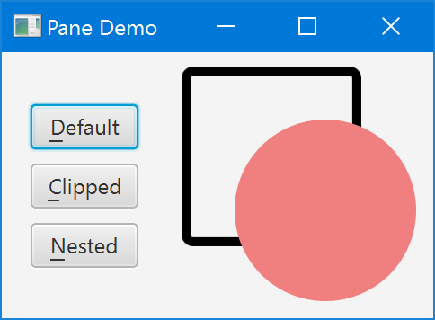
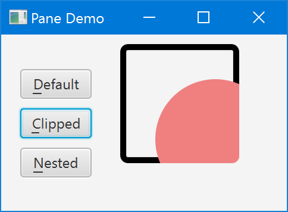
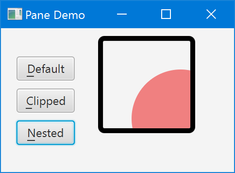

# 裁剪

大多数 JavaFX 布局容器(基类 Region )自动定位和调整其子容器的大小，因此裁剪任何可能超出容器布局边界的子内容从来都不是问题。最大的例外是 Pane，它是 Region 的直接子类，也是所有布局容器的基类，所有布局容器都有可公开访问的子类。与它的子类不同，Pane 不尝试安排它的子类，而只是接受显式的用户定位和大小。

这使得窗格适合作为绘图表面，类似于画布，但渲染用户定义的形状子而不是直接绘制命令。问题是，绘制表面通常期望在其边界处自动剪切其内容。Canvas  默认这样做，但  Pane 没有。从窗格的 Javadoc  条目的最后一段:

> 窗格默认情况下不会剪辑其内容，因此，如果子窗格位于负坐标或窗格的大小被调整为小于其首选大小，则子窗格的边界可能会扩展到其自身边界之外。

这句话有点误导人。无论位置和大小的组合是否为负值或窗格是否调整过大小，“每当”子窗格的位置和大小组合超出父窗格的范围时，子窗格都将(全部或部分)呈现在父窗格之外。很简单，Pane 只根据它的左上角向它的子节点提供坐标移动——但是在呈现子节点时，它的布局边界完全被忽略。请注意，所有 Pane 子类(我检查过的)的 Javadoc 都包含类似的警告。它们也不会剪辑它们的内容，但正如上面提到的，这对它们来说通常不是问题，因为它们会自动安排它们的孩子。

因此，为了正确地使用窗格作为形状的绘图表面，我们需要手动剪辑其内容。这有点复杂，特别是当涉及到一个可见的边界时。我编写了一个小的演示应用程序来说明默认行为和修复它的各种步骤。您可以将其下载为  [PaneDemo.zip](http://kynosarges.org/misc/PaneDemo.zip)，其中包含 NetBeans 8.2 和 Java SE 8u112 的项目。下面几节用屏幕截图和相关代码片段解释每个步骤。

## 默认行为

启动时，PaneDemo 显示了当你将一个椭圆形状放入一个太小而无法完全包含它的窗格中时会发生什么。窗格有一个很好的厚的圆形边框，以可视化它的面积。应用程序窗口可调整大小，窗格大小跟随窗口大小。左边的三个按钮用于切换到演示中的其他步骤；单击 Default (Alt+D) 以从后面的步骤恢复到默认输出。



正如您所看到的，椭圆覆盖了其父边框，并突出到其父边框之外。下面的代码用于生成默认视图。它被分成几个较小的方法，以及 Border 角半径的常量，因为它们将在接下来的步骤中被引用。

```java
static final double BORDER_RADIUS = 4;

static Border createBorder() {
    return new Border(
            new BorderStroke(Color.BLACK, BorderStrokeStyle.SOLID,
            new CornerRadii(BORDER_RADIUS), BorderStroke.THICK));
}

static Shape createShape() {
    final Ellipse shape = new Ellipse(50, 50);
    shape.setCenterX(80);
    shape.setCenterY(80);
    shape.setFill(Color.LIGHTCORAL);
    shape.setStroke(Color.LIGHTCORAL);
    return shape;
}

static Region createDefault() {
    final Pane pane = new Pane(createShape());
    pane.setBorder(createBorder());
    pane.setPrefSize(100, 100);
    return pane;
}
```

## 简单的裁剪

令人惊讶的是，没有预定义的选项可以让可调整大小的区域自动将其子区域剪辑为当前大小。相反，您需要使用 Node 上定义的基本 [clipProperty ](https://docs.oracle.com/javase/8/javafx/api/javafx/scene/Node.html#clipProperty)，并手动更新它，以反映布局边界的变化。下面的 clipChildren 方法展示了它是如何工作的(使用 Javadoc，因为你可能想在自己的代码中重用它):

```java
/**
*剪辑指定的{@链接区域}的子节点到它的当前大小。
*这需要在区域的布局边界上附加一个变化监听器。
*因为JavaFX目前没有提供任何内置的方式来剪辑子节点。
*
* @param Region{@link Region}，其子区域被剪辑
* @param arc {@link Rectangle#arcWidth}和{@link Rectangle#arcHeight}
* 剪切@link Rectangle}
*如果{@code region}是 null，则抛出NullPointerException
 */
static void clipChildren(Region region, double arc) {

    final Rectangle outputClip = new Rectangle();
    outputClip.setArcWidth(arc);
    outputClip.setArcHeight(arc);
    region.setClip(outputClip);

    region.layoutBoundsProperty().addListener((ov, oldValue, newValue) -> {
        outputClip.setWidth(newValue.getWidth());
        outputClip.setHeight(newValue.getHeight());
    });
}

static Region createClipped() {
    final Pane pane = new Pane(createShape());
    pane.setBorder(createBorder());
    pane.setPrefSize(100, 100);

    // clipped children still overwrite Border!
    clipChildren(pane, 3 * BORDER_RADIUS);

    return pane;
}
```

在 PaneDemo 中选择 Clipped (Alt+C) 来呈现相应的输出。看起来是这样的:



这是更好的。椭圆不再突出超出窗格-但仍然覆盖其边框。还需要注意的是，我们必须手动为裁剪矩形指定一个估计的圆角，以反映圆角边框的角。这个估计值是 3 * BORDER_RADIUS，因为在 Border 上指定的角半径实际上定义了它的内部半径，而外部半径(我们在这里需要的)将根据边框的厚度而更大。(如果你真的想的话，你可以精确地计算外半径，但我在演示应用程序中跳过了这一步。)

## 嵌套的Panes

我们能以某种方式指定一个剪辑区域，排除一个可见的“边界”吗?据我所知，画窗格本身没有。裁剪区域会影响边框以及其他内容，因此如果您要缩小裁剪区域以排除它，您将不再看到任何边框。相反，解决方案是创建两个嵌套窗格:一个没有边框的内部绘图窗格，它精确地剪辑到它的边界，一个外部的 StackPane 定义了可见的边框，也调整了绘图窗格的大小。下面是最后的代码:

```java
static Region createNested() {
    // create drawing Pane without Border or size
    final Pane pane = new Pane(createShape());
    clipChildren(pane, BORDER_RADIUS);

    // create sized enclosing Region with Border
    final Region container = new StackPane(pane);
    container.setBorder(createBorder());
    container.setPrefSize(100, 100);
    return container;
}
```

在 PaneDemo 中选择嵌套 (Alt+N) 来呈现相应的输出。现在一切看起来都应该:



这样做的额外好处是我们不再需要猜测裁剪矩形的正确角半径。我们现在剪辑到内部而不是外部边界的可见边界，所以我们可以直接重用它的内角半径。如果指定多个不同的角半径或更复杂的边框，则必须定义相应的更复杂的裁剪形状。

这里有一个小小的警告。与所有子坐标相对的绘图窗格的左上角现在开始于可见的边框内。如果您追溯性地将具有可见边框的单个窗格更改为嵌套窗格(如下所示)，则所有子窗格将显示与边框厚度相对应的轻微定位移位。