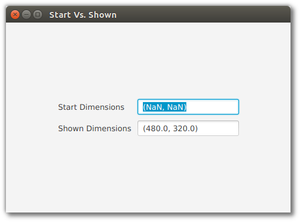

# 时机

理解 JavaFX UI 控件的创建和控件的显示之间的时间差异是很重要的。在创建 UI 控件时——无论是通过直接的 API 对象创建还是通过 FXML 创建——您可能会遗漏某些屏幕几何值，比如窗口的尺寸。稍后，当屏幕显示给用户时，就可以使用这个功能。这个显示事件称为 onshow ，它是分配窗口和完成最终布局计算的时间。

为了演示这一点，请考虑下面的程序，它在创建UI控件时显示屏幕尺寸，在显示屏幕时显示屏幕尺寸。下面的屏幕截图显示了程序的运行情况。当 UI 控件被创建 (new VBox()， new Scene()， primaryStage.setScene()) 时，没有实际的窗口高度和宽度值可用，未定义的 “NaN” 值证明了这一点。



*屏幕几何图形在显示之前不可用*


但是，一旦显示窗口，宽度和高度的值就可用了。该程序为 onshow 事件注册一个事件处理程序，并准备相同的输出。

下面是演示程序的 Java 类。

*StartVsShownJavaFXApp.class*

```java
public class StartVsShownJavaFXApp extends Application {

    private DoubleProperty startX = new SimpleDoubleProperty();
    private DoubleProperty startY = new SimpleDoubleProperty();
    private DoubleProperty shownX = new SimpleDoubleProperty();
    private DoubleProperty shownY = new SimpleDoubleProperty();

    @Override
    public void start(Stage primaryStage) throws Exception {

        Label startLabel = new Label("Start Dimensions");
        TextField startTF = new TextField();
        startTF.textProperty().bind(
                Bindings.format("(%.1f, %.1f)", startX, startY)
        );

        Label shownLabel = new Label("Shown Dimensions");
        TextField shownTF = new TextField();
        shownTF.textProperty().bind(
                Bindings.format("(%.1f, %.1f)", shownX, shownY)
        );

        GridPane gp = new GridPane();
        gp.add( startLabel, 0, 0 );
        gp.add( startTF, 1, 0 );
        gp.add( shownLabel, 0, 1 );
        gp.add( shownTF, 1, 1 );
        gp.setHgap(10);
        gp.setVgap(10);

        HBox hbox = new HBox(gp);
        hbox.setAlignment(CENTER);

        VBox vbox = new VBox(hbox);
        vbox.setAlignment(CENTER);

        Scene scene = new Scene( vbox, 480, 320 );

        primaryStage.setScene( scene );

        // before show()...I just set this to 480x320, right?
        startX.set( primaryStage.getWidth() );
        startY.set( primaryStage.getHeight() );

        primaryStage.setOnShown( (evt) -> {
            shownX.set( primaryStage.getWidth() );
            shownY.set( primaryStage.getHeight() );  // all available now
        });

        primaryStage.setTitle("Start Vs. Shown");
        primaryStage.show();
    }

    public static void main(String[] args) {
        launch(args);
    }
}
```

有时，您会提前知道屏幕尺寸，并且可以在 JavaFX 程序的任何时候使用这些值。这包括在 onshow 事件之前。但是，如果您的初始化序列包含需要这些值的逻辑，则需要使用 onshow 事件。用例可能使用最后保存的维度或基于程序输入的维度。
