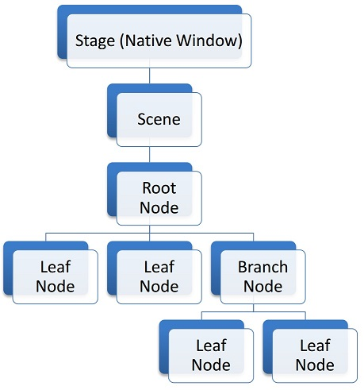

# 概述
场景图是一种树形数据结构，它排列(和分组)图形对象，以便更容易地进行逻辑表示。它还允许图形引擎通过完全或部分跳过最终图像中看不到的对象，以最有效的方式渲染对象。下图显示了JavaFX场景图架构的一个示例。


在上面结构的最顶层有一个 Stage （舞台）。Stage （舞台）是本机操作系统 JavaFX的窗口表示。在任何给定的时间，一个 Stage （舞台）都可以有一个单独的 Scene （场景）。Scene （场景）是 JavaFX  场景图的容器。

JavaFX 场景图中的所有元素都表示为 Node 对象。有三种类型的节点: root （根）、branch （枝）和 leaf （叶）。根节点是唯一没有父节点且直接包含在场景中的节点，如上图所示。分支和叶节点的区别在于叶节点没有子节点。

在场景图中，父节点的许多属性对子节点共享。例如，应用于父节点的转换或事件也将递归地应用于它的子节点。因此，可以将复杂的节点层次结构视为单个节点，以简化编程模型。我们将在后面的部分中探讨转换和事件。

下图是 “Hello World” 场景图的一个例子。


对于上图，下面的代码是一个简单的示例：
```java
public class HelloApp extends Application {

    private Parent createContent() {
        return new StackPane(new Text("Hello World"));
    }

    @Override
    public void start(Stage stage) throws Exception {
        stage.setScene(new Scene(createContent(), 300, 300));
        stage.show();
    }

    public static void main(String[] args) {
        launch(args);
    }
}
```
运行代码的结果如下图所示。


说明：

- 一个节点最多只能有一个父节点。

- “活动”(附加到当前可见场景)场景图中的节点只能从JavaFX应用程序线程进行修改。