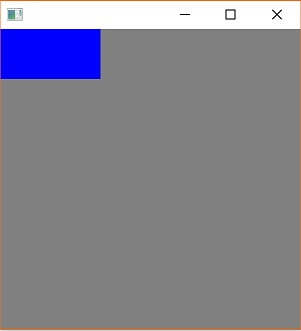
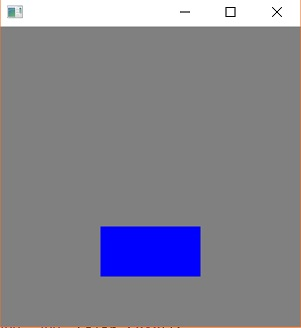
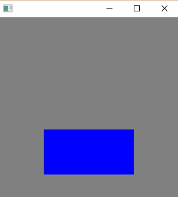
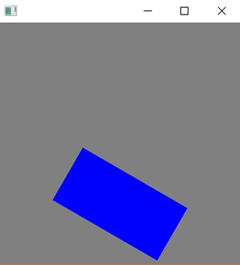

# 转换
我们将使用下面的代码作为示例来演示 3 种最常见的转换。
```java
public class TransformApp extends Application {

    private Parent createContent() {
        Rectangle box = new Rectangle(100, 50, Color.BLUE);

        transform(box);

        return new Pane(box);
    }

    private void transform(Rectangle box) {
        // we will apply transformations here
    }

    @Override
    public void start(Stage stage) throws Exception {
        stage.setScene(new Scene(createContent(), 300, 300, Color.GRAY));
        stage.show();
    }

    public static void main(String[] args) {
        launch(args);
    }
}
```
运行应用程序将产生以下图像。


在 JavaFX 中，简单的转换可以在 X、Y 、Z 这 3  个轴上的任何一个轴进行转换。示例应用程序是 2D 的，因此我们将只考虑 X 和 Y 轴。

## 平移
在 JavaFX 和计算机图形学中，平移意味着移动。我们可以在 X 轴上平移 100 像素在 Y 轴上平移 200像素。
```java
private void transform(Rectangle box) {
    box.setTranslateX(100);
    box.setTranslateY(200);
}
```

## 缩放
您可以用缩放来使节点变大或变小。缩放值是一个比率。默认情况下，节点在每个轴上的缩放值为1(100%)。我们可以通过在 X  轴和 Y 轴上应用 1.5 的缩放来扩大我们的盒子。
```java
private void transform(Rectangle box) {
    // previous code

    box.setScaleX(1.5);
    box.setScaleY(1.5);
}
```


## 旋转
节点的旋转决定了节点呈现的角度。在 2D 中，唯一合理的旋转轴是 Z 轴。让我们把盒子旋转30度。
```java
private void transform(Rectangle box) {
    // previous code

    box.setRotate(30);
}
```

