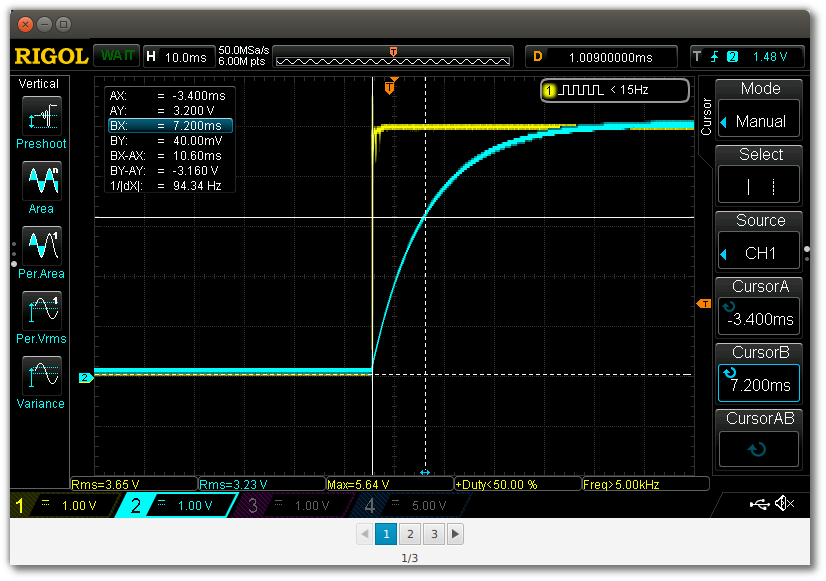

# 分页

Pagination 是一种分页 UI 控件，它允许您使用 next、previous 和直接索引按钮逐步遍历结果块。当不需要滚动时，Pagination 类可以拆分长列表。本节将介绍一种特殊情况，即单条目页面可以形成幻灯片。

## 侧边栏显示 App

这张截图显示了这个应用程序，它是三张图片的幻灯片。Pagination 控件呈现自定义 Node (一个 ImageView )和屏幕底部的按钮。对于这三个图像中的每一个，都有一个直接访问按钮 1、2 和 3 。也有一对箭头移动到下一个和上一个图像。标签标记图像索引和图像数量，以补充按钮本身的视觉提示。



程序首先定义一个包含三个 JavaFX 图像的数组: imageurl。在 start() 方法中，创建了一个引用数组大小的 Pagination 对象。提供了一个 PageFactory，它基于 pageIndex 参数创建一个 Node。对于本例，pageIndex 是 imageurl 数组的索引。

程序形成一个场景，并将其添加到初级阶段。

*SlideShowApp.java*

```java
public class SlideShowApp extends Application {

    private Image[] imageURLs = {
            new Image("https://www.bekwam.net/images/bekwam_rc_charging.png"),
            new Image("https://www.bekwam.net/images/bekwam_rc_discharging.png"),
            new Image("https://www.bekwam.net/images/bekwam_rl_scope.png")
    };

    @Override
    public void start(Stage primaryStage) throws Exception {

        Pagination pagination = new Pagination(imageURLs.length, 0);
        pagination.setPageFactory(
            pageIndex -> new ImageView(imageURLs[pageIndex])
        );

        VBox vbox = new VBox( pagination );

        Scene scene = new Scene(vbox);

        primaryStage.setScene( scene );
        primaryStage.show();
    }

    public static void main(String[] args) {
        launch(args);
    }
}
```

Pagination 类是一个简单的控件，用于遍历一长串项目。本例使用每页一个项目来形成幻灯片。在这两种情况下，这都是滚动的另一种选择，当您希望 UI 固定在某个位置时非常有用。