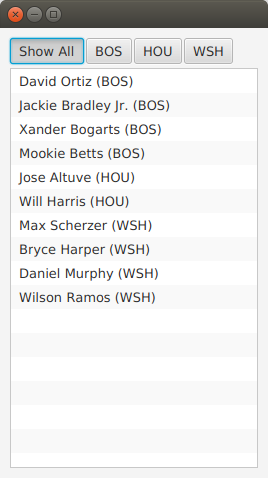

# JavaFX 中的列表筛选

本文演示了如何在 JavaFX 应用程序中过滤 列表。应用程序管理两个列表。一个列表包含数据模型中的所有项。第二个列表包含当前正在查看的项目。作为过滤器存储的比较逻辑碎片在两者之间进行调解。

绑定被大量用于保持数据结构与用户选择的数据结构同步。

这个屏幕截图显示了应用程序，其中包含设置过滤器的 ToggleButtons 的顶部一行和包含对象的 ListView。



完整的代码会在本文末尾列出。

## 数据结构

程序以一个领域模型Player和一个Player对象数组开始。

```java
static class Player {

	private final String team;
	private final String playerName;
	public Player(String team, String playerName) {
		this.team = team;
		this.playerName = playerName;
	}
	public String getTeam() {
		return team;
	}
	public String getPlayerName() {
		return playerName;
	}
	@Override
	public String toString() { return playerName + " (" + team + ")"; }
}
```

Player 类包含一对字段，team 和 playerName。提供了一个 toString()，这样当对象被添加到 ListView (稍后介绍)时，就不需要自定义 ListCell 类了。

本例的测试数据是美国棒球运动员的列表。

```java
Player[] players = {new Player("BOS", "David Ortiz"),
                    new Player("BOS", "Jackie Bradley Jr."),
                    new Player("BOS", "Xander Bogarts"),
                    new Player("BOS", "Mookie Betts"),
                    new Player("HOU", "Jose Altuve"),
                    new Player("HOU", "Will Harris"),
                    new Player("WSH", "Max Scherzer"),
                    new Player("WSH", "Bryce Harper"),
                    new Player("WSH", "Daniel Murphy"),
                    new Player("WSH", "Wilson Ramos") };
```

##  Model

正如本文开头所提到的，ListView 过滤以两个列表的管理为中心。所有的对象都存储在一个包装好的ObservableList playersProperty 中，当前可见的对象存储在一个包装好的 FilteredList，viewablePlayersProperty中。viewablePlayersProperty 是建立在 playersProperty 的基础上的，所以对满足 FilteredList 条件的球员所做的更新也将被用于 viewablePlayers。

```java
ReadOnlyObjectProperty<ObservableList<Player>> playersProperty =
		new SimpleObjectProperty<>(FXCollections.observableArrayList());

ReadOnlyObjectProperty<FilteredList<Player>> viewablePlayersProperty =
		new SimpleObjectProperty<FilteredList<Player>>(
				new FilteredList<>(playersProperty.get()
						));
```

filterProperty() 方便地允许调用者绑定到底层谓词。

```java
ObjectProperty<Predicate<? super Player>> filterProperty =
	viewablePlayersProperty.get().predicateProperty();
```

UI 的根节点是一个 VBox，它包含一个 HBox 的  ToggleButtons 和一个 ListView 列表。

```java
VBox vbox = new VBox();
vbox.setPadding( new Insets(10));
vbox.setSpacing(4);

HBox hbox = new HBox();
hbox.setSpacing( 2 );

ToggleGroup filterTG = new ToggleGroup();
```

##  过滤行为

ToggleButtons 附加了一个处理程序，它将修改 filterProperty。在 userData 字段中为每个 ToggleButton 提供一个谓词。toggleHandler 在设置过滤器属性时使用这个提供的谓词。这段代码设置了特殊情况下的“显示全部”按钮。

```java
@SuppressWarnings("unchecked")
EventHandler<ActionEvent> toggleHandler = (event) -> {
		ToggleButton tb = (ToggleButton)event.getSource();
	    Predicate<Player> filter = (Predicate<Player>)tb.getUserData();
	    filterProperty.set( filter );
	};

ToggleButton tbShowAll = new ToggleButton("Show All");
tbShowAll.setSelected(true);
tbShowAll.setToggleGroup( filterTG );
tbShowAll.setOnAction(toggleHandler);
tbShowAll.setUserData( (Predicate<Player>) (Player p) -> true);
```

过滤特定球队的 ToggleButtons 是在运行时基于 Players 数组创建的。这个流做以下工作。

- 将球员列表提取为一个独特的球队字符串列表

- 为每个团队字符串创建一个ToggleButton

- 为每个 ToggleButton 设置谓词，以用作过滤器

- 收集 ToggleButtons 以便添加到 HBox 容器中

```java
List<ToggleButton> tbs = Arrays.asList( players)
		.stream()
		.map( (p) -> p.getTeam() )
		.distinct()
		.map( (team) -> {
			ToggleButton tb = new ToggleButton( team );
			tb.setToggleGroup( filterTG );
			tb.setOnAction( toggleHandler );
			tb.setUserData( (Predicate<Player>) (Player p) -> team.equals(p.getTeam()) );
			return tb;
		})
		.collect(Collectors.toList());

hbox.getChildren().add( tbShowAll );
hbox.getChildren().addAll( tbs );
```

## ListView 列表

下一步创建 ListView 并将 ListView 绑定到 viewablePlayersProperty。这使得 ListView 能够根据不断变化的过滤器接收更新。

```java
ListView<Player> lv = new ListView<>();
lv.itemsProperty().bind( viewablePlayersProperty );
```

程序的其余部分创建一个场景并显示舞台。onshow 将数据集加载到 playersProperty 和 viewablePlayersProperty 列表中。尽管在这个特定版本的程序中，两个列表是同步的，但如果stock过滤器与“no filter”完全不同，则不需要修改此代码。

```java
vbox.getChildren().addAll( hbox, lv );

Scene scene = new Scene(vbox);

primaryStage.setScene( scene );
		primaryStage.setOnShown((evt) -> {
			playersProperty.get().addAll( players );
		});

primaryStage.show();
```

本文使用绑定将可查看的 Player 对象列表绑定到 ListView。当选择切换按钮时，可查看的球员被更新。这个选择应用了一个过滤器到一个完整的球员集合，它被单独维护为一个 FilteredList (感谢@kleopatra_jx)。绑定用于保持UI同步，并允许在设计中分离关注点。

## Further Reading

要了解这种设计如何实现基本的添加和删除功能，请访问以下页面

https://courses.bekwam.net/public_tutorials/bkcourse_filterlistapp.php.

## 完整的代码

代码可以在单个.java文件中进行测试。

```java
public class FilterListApp extends Application {

	@Override
	public void start(Stage primaryStage) throws Exception {

		//
		// Test data
		//
		Player[] players = {new Player("BOS", "David Ortiz"),
		                    new Player("BOS", "Jackie Bradley Jr."),
		                    new Player("BOS", "Xander Bogarts"),
		                    new Player("BOS", "Mookie Betts"),
		                    new Player("HOU", "Jose Altuve"),
		                    new Player("HOU", "Will Harris"),
		                    new Player("WSH", "Max Scherzer"),
		                    new Player("WSH", "Bryce Harper"),
		                    new Player("WSH", "Daniel Murphy"),
		                    new Player("WSH", "Wilson Ramos") };

		//
		// Set up the model which is two lists of Players and a filter criteria
		//
		ReadOnlyObjectProperty<ObservableList<Player>> playersProperty =
				new SimpleObjectProperty<>(FXCollections.observableArrayList());

		ReadOnlyObjectProperty<FilteredList<Player>> viewablePlayersProperty =
				new SimpleObjectProperty<FilteredList<Player>>(
						new FilteredList<>(playersProperty.get()
								));

		ObjectProperty<Predicate<? super Player>> filterProperty =
			viewablePlayersProperty.get().predicateProperty();


		//
		// Build the UI
		//
		VBox vbox = new VBox();
		vbox.setPadding( new Insets(10));
		vbox.setSpacing(4);

		HBox hbox = new HBox();
		hbox.setSpacing( 2 );

		ToggleGroup filterTG = new ToggleGroup();

		//
		// The toggleHandler action wills set the filter based on the TB selected
		//
		@SuppressWarnings("unchecked")
		EventHandler<ActionEvent> toggleHandler = (event) -> {
				ToggleButton tb = (ToggleButton)event.getSource();
			    Predicate<Player> filter = (Predicate<Player>)tb.getUserData();
			    filterProperty.set( filter );
			};

		ToggleButton tbShowAll = new ToggleButton("Show All");
		tbShowAll.setSelected(true);
		tbShowAll.setToggleGroup( filterTG );
		tbShowAll.setOnAction(toggleHandler);
		tbShowAll.setUserData( (Predicate<Player>) (Player p) -> true);

		//
		// Create a distinct list of teams from the Player objects, then create
		// ToggleButtons
		//
		List<ToggleButton> tbs = Arrays.asList( players)
				.stream()
				.map( (p) -> p.getTeam() )
				.distinct()
				.map( (team) -> {
					ToggleButton tb = new ToggleButton( team );
					tb.setToggleGroup( filterTG );
					tb.setOnAction( toggleHandler );
					tb.setUserData( (Predicate<Player>) (Player p) -> team.equals(p.getTeam()) );
					return tb;
				})
				.collect(Collectors.toList());

		hbox.getChildren().add( tbShowAll );
		hbox.getChildren().addAll( tbs );

		//
		// Create a ListView bound to the viewablePlayers property
		//
		ListView<Player> lv = new ListView<>();
		lv.itemsProperty().bind( viewablePlayersProperty );

		vbox.getChildren().addAll( hbox, lv );

		Scene scene = new Scene(vbox);

		primaryStage.setScene( scene );
		primaryStage.setOnShown((evt) -> {
			playersProperty.get().addAll( players );
		});

		primaryStage.show();

	}

	public static void main(String args[]) {
		launch(args);
	}

	static class Player {

		private final String team;
		private final String playerName;
		public Player(String team, String playerName) {
			this.team = team;
			this.playerName = playerName;
		}
		public String getTeam() {
			return team;
		}
		public String getPlayerName() {
			return playerName;
		}
		@Override
		public String toString() { return playerName + " (" + team + ")"; }
	}
}
```

