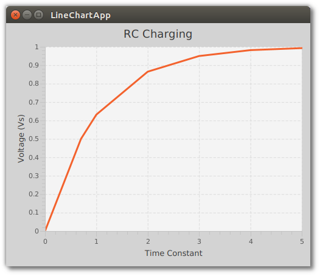

# 折线图

虽然您可以在画布上使用线来绘制图形，但  JavaFX 的 LineChart 使绘图变得更容易。除了自定义标准图表组件(如轴图例)外，LineChart 还封装了图的源数据。与所有 JavaFX 控件一样，LineChart 允许您使用 CSS 为图形设置样式。

这个截图显示了一个由七个点组成的图。x 轴的时间常数单位从 0 到 5 。y 轴显示电压范围从 0 到 1，比 x 轴更频繁的梯度。



## 数据

*LineChartApp.java*

```java
   public class LineChartApp extends Application {

    @Override
    public void start(Stage primaryStage) throws Exception {

        XYChart.Series<Double, Double> series = new XYChart.Series<>();
        series.getData().add( new XYChart.Data<>(0.0,0.0));
        series.getData().add( new XYChart.Data<>(0.7,0.5));
        series.getData().add( new XYChart.Data<>(1.0,0.632));
        series.getData().add( new XYChart.Data<>(2.0,0.865));
        series.getData().add( new XYChart.Data<>(3.0,0.95));
        series.getData().add( new XYChart.Data<>( 4.0, 0.982 ));
        series.getData().add( new XYChart.Data<>( 5.0, 0.993 ));
```

每个数据点都是一个xy图。添加到XYChart中的数据对象。系列容器。要显示不同系列的比较，请创建额外的XYChart。系列对象。这些将被LineChart渲染成不同的颜色。

## 图表

LineChart对象是用Axis对象创建的。第一个Axis参数用于X轴。每个Axis对象包括一个可选标签:时间常数，电压(v)。接下来的两个数值参数给出了下界和上界。最后一个参数设置步长增量。LineChart构造函数的另一种形式(在本例中未使用)接受数据。这个例子对LineChart的data字段进行了显式的add()调用。

*LineChartApp.java*

```java
 LineChart lc = new LineChart(
                new NumberAxis("Time Constant", 0.0, 5.0, 1),
                new NumberAxis("Voltage (Vs)", 0.0, 1.0, 0.1)
                );

        lc.getData().add( series );
```

LineChart 可以使用 setTitle() 和 setStyle() 自定义一个标题和一个单独的样式。为了保持一致性，最好使用样式表，以便可以跨一组 LineCharts 应用单个样式定义。

*LineChartApp.java*

```java
        lc.setTitle("RC Charging");
        lc.setStyle("-fx-background-color: lightgray");
```

可以设置许多其他属性来配置LineChart。setLegendVisible()删除了一个系列标识符，因为这个图中只有一个系列。setCreateSymbols() 将在图形的原点和末端的每个数据点上删除一个图形。

*LineChartApp.java*

```java
        lc.setCreateSymbols(false);
        lc.setLegendVisible(false);
```

对于适度的报告需求，JavaFX 提供了像 LineChart 这样的类来将多个数据点序列绘制成一个图。LineChart 对象是高度可定制的，可以控制图例、线条和数据点图标。此外，CSS 样式可以使这些报告保持一致。

## 完整代码

完整的源代码和 Gradle 项目可以在下面的链接中找到。

[ChartApp Source Zip](https://courses.bekwam.net/public_tutorials/source/bkcourse_chartapp_sources.zip)