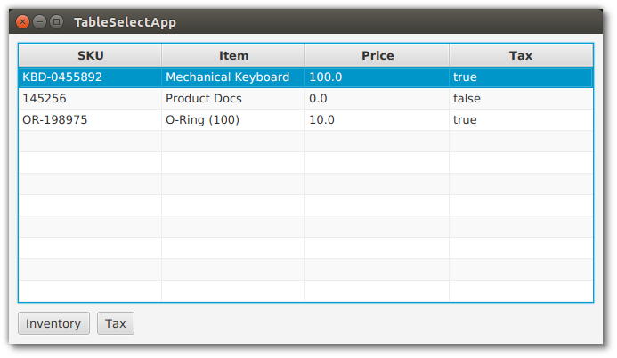

# 表格

对于JavaFX商业应用程序，TableView是一个必不可少的控件。当你需要在一个扁平的行/列结构中显示多个记录时，使用TableView。这个例子展示了TableView的基本元素，并演示了应用JavaFX绑定时组件的强大功能。

演示应用程序是一个TableView和一对button。TableView有四个tablecolumn: SKU, Item, Price, Tax。TableView在三行中显示了三个对象:机械键盘，产品文档，o形环。下面的截图显示了启动后的应用程序。


按钮的禁用逻辑是基于TableView中的选择。最初，没有选择任何项目，因此两个按钮都被禁用。如果选择了任何项目(以下截图中的第一个项目)，则启用库存按钮。也启用了Tax按钮，尽管这需要查询Tax值。



如果所选项目的Tax值为false，则Tax按钮将被禁用。这个屏幕截图显示了选中的第二个项目。“库存”按钮启用，但“税务”按钮未启用。


## 模型和声明

TableView 基于一个名为 Item 的 POJO 模型。

*Item.java*

```java
public class Item {

    private final String sku;
    private final String descr;
    private final Float price;
    private final Boolean taxable;

    public Item(String sku, String descr, Float price, Boolean taxable) {
        this.sku = sku;
        this.descr = descr;
        this.price = price;
        this.taxable = taxable;
    }

    public String getSku() {
        return sku;
    }

    public String getDescr() {
        return descr;
    }

    public Float getPrice() {
        return price;
    }

    public Boolean getTaxable() {
        return taxable;
    }
}
```

TableView 和 TableColumn 在它们的声明中使用泛型。对于 TableView，type 参数是 Item。对于 TableColumns，类型参数是 Item 和字段类型。TableColumn 的构造函数接受一个列名。在本例中，列名与实际字段名略有不同。

*TableSelectApp.java*

```java
TableView<Item> tblItems = new TableView<>();

        TableColumn<Item, String> colSKU = new TableColumn<>("SKU");
        TableColumn<Item, String> colDescr = new TableColumn<>("Item");
        TableColumn<Item, Float> colPrice = new TableColumn<>("Price");
        TableColumn<Item, Boolean> colTaxable = new TableColumn<>("Tax");

        tblItems.getColumns().addAll(
            colSKU, colDescr, colPrice, colTaxable
        );
```

向 TableView 添加模型项是通过向底层集合添加项来完成的。

*TableSelectApp.java*

```java
 tblItems.getItems().addAll(
            new Item("KBD-0455892", "Mechanical Keyboard", 100.0f, true),
            new Item( "145256", "Product Docs", 0.0f, false ),
            new Item( "OR-198975", "O-Ring (100)", 10.0f, true)
        );
```

此时，TableView 已经配置好，测试数据也已经添加。但是，如果您要查看程序，您将看到三行空行。这是因为 JavaFX 缺少 POJO 和T ableColumns 之间的链接。该链接使用cellValueFactory添加到TableColumns中。

*TableSelectApp.java*

```java
		colSKU.setCellValueFactory( new PropertyValueFactory<>("sku") );
        colDescr.setCellValueFactory( new PropertyValueFactory<>("descr") );
        colPrice.setCellValueFactory( new PropertyValueFactory<>("price") );
        colTaxable.setCellValueFactory( new PropertyValueFactory<>("taxable") );
```

此时查看程序将在适当的列中显示数据。

## 选择

要检索 TableView 中选定的一个或多个项目，请使用单独的 selectionModel 对象。调用 tblItems.getSelectionModel() 返回一个包含属性 “selectedItem” 的对象。这可以在方法中检索和使用，例如调出编辑详细信息屏幕。另外，getSelectionModel() 可以为绑定表达式返回一个 JavaFX 属性 “selectedItemProperty”。

在演示应用中，两个 button 被绑定到 TableView 的 selectionModel。在没有绑定的情况下，您可以添加侦听器来检查选择并对 Button 进行类似 setDisabled() 的调用。在 TableView 选择之前，你还需要初始化逻辑来处理没有选择的情况。绑定语法在声明性语句中表达此逻辑，该声明性语句可以在一行中处理侦听器和初始化。

*TableSelectApp.java*

```java
        Button btnInventory = new Button("Inventory");
        Button btnCalcTax = new Button("Tax");

        btnInventory.disableProperty().bind(
            tblItems.getSelectionModel().selectedItemProperty().isNull() (1)
        );
```

1. 请参阅“最佳实践”下的“忽略Null选择绑定表达式的警告”，以了解如何在使用此构造时关闭警告消息

如果没有选择项目，btnInventory disable 属性将为 true (isNull())。当屏幕第一次显示时，没有选择，按钮被禁用。一旦做出任何选择，btnInventory 将被启用 (disable=false)。

btnCalcTax 逻辑稍微复杂一些。当没有选择时，btnCalcTax 也被禁用。然而，btnCalcTax 也会考虑 selectedItem 的内容。组合绑定 or() 用于连接这两个条件。和前面一样，没有选择也有一个 isNull() 表达式。binding .select() 检查Item.taxable 的值。一个真正的应税项目将启用 btnCalcTax，而一个假的项目将禁用按钮。

*TableSelectApp.java*

```java
        btnCalcTax.disableProperty().bind(
            tblItems.getSelectionModel().selectedItemProperty().isNull().or(
                    Bindings.select(
                        tblItems.getSelectionModel().selectedItemProperty(),
                        "taxable"
                    ).isEqualTo(false)
            )
        );
```

select() 是从对象中提取字段的机制。selectedItemProperty() 是不断变化的 selectedItem，而 "taxable" 是到应税字段的单跳路径。

这个例子展示了如何基于 POJO 建立一个 TableView。它还提供了一对功能强大的绑定表达式，允许您链接相关控件，而无需编写额外的侦听器和初始化代码。TableView 是 JavaFX 业务应用程序开发人员不可缺少的控件。它将是显示结构化项列表的最佳和最熟悉的控件。

## 完整代码

下面是应用程序的完整代码。它是一对类文件 TableSelectApp.java 和 Item.java。java在前面的一节中已经完整地介绍过了。

*TableSelectApp.java*

```java
public class TableSelectApp extends Application {

    @Override
    public void start(Stage primaryStage) throws Exception {

        TableView<Item> tblItems = new TableView<>();
        tblItems.setColumnResizePolicy(TableView.CONSTRAINED_RESIZE_POLICY);

        VBox.setVgrow(tblItems, Priority.ALWAYS );

        TableColumn<Item, String> colSKU = new TableColumn<>("SKU");
        TableColumn<Item, String> colDescr = new TableColumn<>("Item");
        TableColumn<Item, Float> colPrice = new TableColumn<>("Price");
        TableColumn<Item, Boolean> colTaxable = new TableColumn<>("Tax");

        colSKU.setCellValueFactory( new PropertyValueFactory<>("sku") );
        colDescr.setCellValueFactory( new PropertyValueFactory<>("descr") );
        colPrice.setCellValueFactory( new PropertyValueFactory<>("price") );
        colTaxable.setCellValueFactory( new PropertyValueFactory<>("taxable") );

        tblItems.getColumns().addAll(
            colSKU, colDescr, colPrice, colTaxable
        );

        tblItems.getItems().addAll(
            new Item("KBD-0455892", "Mechanical Keyboard", 100.0f, true),
            new Item( "145256", "Product Docs", 0.0f, false ),
            new Item( "OR-198975", "O-Ring (100)", 10.0f, true)
        );

        Button btnInventory = new Button("Inventory");
        Button btnCalcTax = new Button("Tax");

        btnInventory.disableProperty().bind(
            tblItems.getSelectionModel().selectedItemProperty().isNull()
        );

        btnCalcTax.disableProperty().bind(
            tblItems.getSelectionModel().selectedItemProperty().isNull().or(
                    Bindings.select(
                        tblItems.getSelectionModel().selectedItemProperty(),
                        "taxable"
                    ).isEqualTo(false)
            )
        );

        HBox buttonHBox = new HBox( btnInventory, btnCalcTax );
        buttonHBox.setSpacing( 8 );

        VBox vbox = new VBox( tblItems, buttonHBox );
        vbox.setPadding( new Insets(10) );
        vbox.setSpacing( 10 );

        Scene scene = new Scene(vbox);

        primaryStage.setTitle("TableSelectApp");
        primaryStage.setScene( scene );
        primaryStage.setHeight( 376 );
        primaryStage.setWidth( 667 );
        primaryStage.show();
    }

    public static void main(String[] args) {

        launch(args);
    }
}
```

