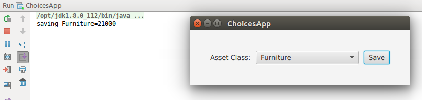

# 选择框
本文演示了 ChoiceBox。ChoiceBox 控件是一个值列表，用户可以从中进行选择。在这个特殊的实现中，有一个空值使选择成为可选的。

下面的截图显示了选择框应用程序。选择“家具”并按下保存按钮。Save Button 调用 println() 来打印对象。



该程序将标签、选择框和按钮放入HBox中。在Save Button上设置一个操作，该操作将打印出该值。

ChoiceBox 最简单的用法是用字符串填充它。本文中的这个 ChoiceBox 构建在一个名为 Pair 的 JavaFX 类上。Pair 是任何键/值对的通用容器，可以用来代替域或其他特殊用途的对象。只有当字符串可以不受操纵地使用或可以一致地解码时，才应该使用它们。

*ChoicesApp.class*

```java
public class ChoicesApp extends Application {

    private final ChoiceBox<Pair<String,String>> assetClass = new ChoiceBox<>();

    @Override
    public void start(Stage primaryStage) throws Exception {

        Label label = new Label("Asset Class:");
        assetClass.setPrefWidth(200);
        Button saveButton = new Button("Save");

        HBox hbox = new HBox(
                label,
                assetClass,
                saveButton);
        hbox.setSpacing( 10.0d );
        hbox.setAlignment(Pos.CENTER );
        hbox.setPadding( new Insets(40) );

        Scene scene = new Scene(hbox);

        initChoice();

        saveButton.setOnAction(
                (evt) -> System.out.println("saving " + assetClass.getValue())
        );

        primaryStage.setTitle("ChoicesApp");
        primaryStage.setScene( scene );
        primaryStage.show();

    }
```

## 字符串转换

当使用复杂对象来支持 ChoiceBox 时，需要 StringConverter。这个对象序列化一个往返于选择框的字符串。对于这个程序，只需要编码 toString() 来替换 Pair 对象的默认 toString()。(toString 和 fromString 都需要实现才能编译。)

空对象 EMPTY_PAIR 用于防止 nullpointerexception。可以访问和比较 assetClass(). getvalue() 的返回值，而无需添加特殊的 null 处理逻辑。

```java
private final static Pair<String, String> EMPTY_PAIR = new Pair<>("", "");

    private void initChoice() {

        List<Pair<String,String>> assetClasses = new ArrayList<>();
        assetClasses.add( new Pair("Equipment", "20000"));
        assetClasses.add( new Pair("Furniture", "21000"));
        assetClasses.add( new Pair("Investment", "22000"));

        assetClass.setConverter( new StringConverter<Pair<String,String>>() {
            @Override
            public String toString(Pair<String, String> pair) {
                return pair.getKey();
            }

            @Override
            public Pair<String, String> fromString(String string) {
                return null;
            }
        });

        assetClass.getItems().add( EMPTY_PAIR );
        assetClass.getItems().addAll( assetClasses );
        assetClass.setValue( EMPTY_PAIR );

    }
```

ChoiceBox 用于从值列表中进行选择。当值列表是复杂类型时，提供 StringFormatter 将列表对象序列化为可呈现的内容。如果可能的话，使用空对象 (而不是 null ) 来支持可选值。

##### 完整的代码:

代码可以在单个 .java 文件中进行测试。

```java
public class ChoicesApp extends Application {

    private final ChoiceBox<Pair<String,String>> assetClass = new ChoiceBox<>();

    private final static Pair<String, String> EMPTY_PAIR = new Pair<>("", "");

    @Override
    public void start(Stage primaryStage) throws Exception {

        Label label = new Label("Asset Class:");
        assetClass.setPrefWidth(200);
        Button saveButton = new Button("Save");

        HBox hbox = new HBox(
                label,
                assetClass,
                saveButton);
        hbox.setSpacing( 10.0d );
        hbox.setAlignment(Pos.CENTER );
        hbox.setPadding( new Insets(40) );

        Scene scene = new Scene(hbox);

        initChoice();

        saveButton.setOnAction(
                (evt) -> System.out.println("saving " + assetClass.getValue())
        );

        primaryStage.setTitle("ChoicesApp");
        primaryStage.setScene( scene );
        primaryStage.show();

    }

    private void initChoice() {

        List<Pair<String,String>> assetClasses = new ArrayList<>();
        assetClasses.add( new Pair("Equipment", "20000"));
        assetClasses.add( new Pair("Furniture", "21000"));
        assetClasses.add( new Pair("Investment", "22000"));

        assetClass.setConverter( new StringConverter<Pair<String,String>>() {
            @Override
            public String toString(Pair<String, String> pair) {
                return pair.getKey();
            }

            @Override
            public Pair<String, String> fromString(String string) {
                return null;
            }
        });

        assetClass.getItems().add( EMPTY_PAIR );
        assetClass.getItems().addAll( assetClasses );
        assetClass.setValue( EMPTY_PAIR );

    }

    public static void main(String[] args) {
        launch(args);
    }
}
```

